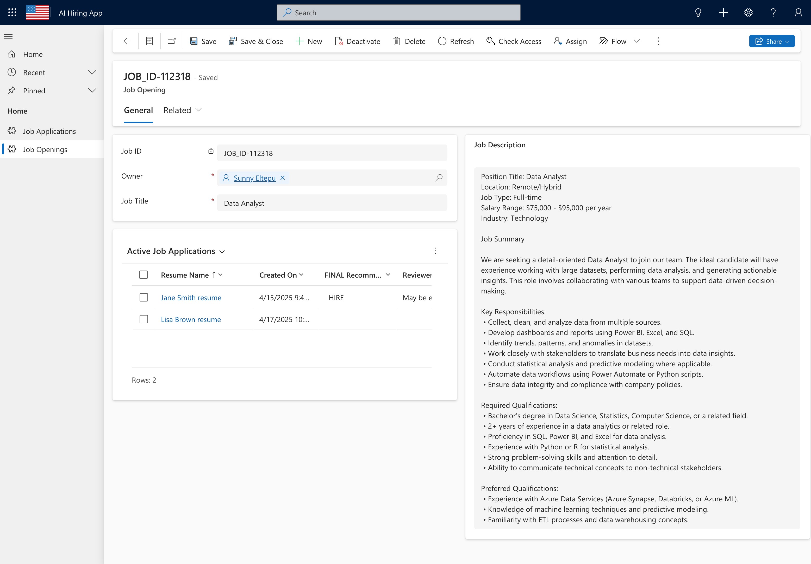
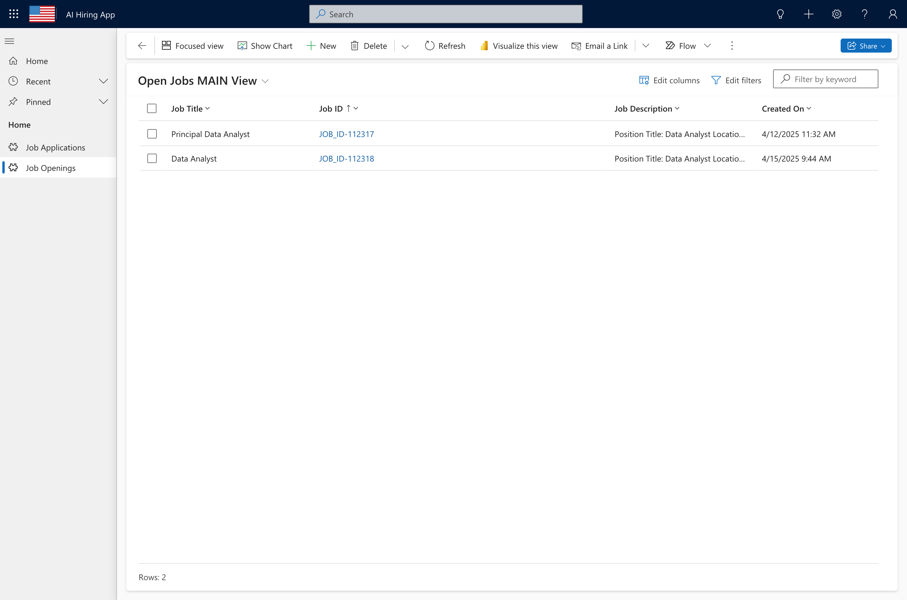
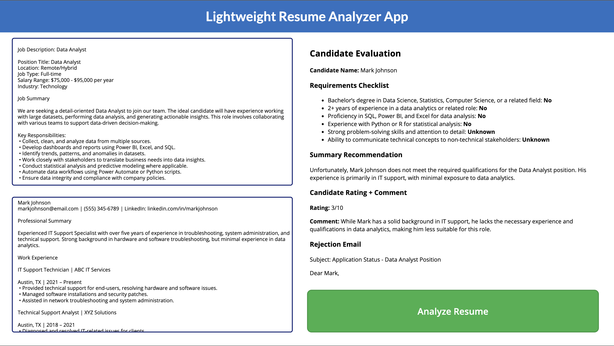

# AI-Powered Job Application Evaluator (Power Platform Solution)

This Power Apps solution allows organizations to evaluate job applicants using AI. It compares the applicant's resume to the job description and generates a recommendation using AI Builder. It is a simple but full solution to track candidates, and can be modified as desired. (unmanaged solution) 

### Sample job application with resume text and AI-generated recommendation.

## Getting Started

Follow these steps to get the solution running:

1. **Create a Job Opening**
   - Fill out the **Job Description** field carefully. This will be used to assess applicants.

2. **Create a Job Application**
   - Fill out all required fields.
   - Paste the applicant’s resume into the **Resume Text** field.

3. **Save the Record**
   - Saving the application triggers a Power Automate flow.
   - This runs the AI model and generates a recommendation.

4. **Refresh the Record**
   - After about one minute, refresh the application record.
   - The **AI Generated Recommendation** field should now be populated.

## 🧩 Solution Components

### 🧠 Apps
- `AI Hiring App`(Model-Driven App): Manage job openings and the application process.
- `Lightweight Resume Analyzer App` (Canvas app): A lightweight experience to test or use the AI recommendation quickly. No need to create any job opening record, etc. Just a quick recommendation of a resume against a job description.

### ⚙️ AI Builder AI Prompts
Compares the resume text to the job description and provides a tailored recommendation. 
2 AI Prompts - one for the lightweight app and one for the main model driven app. 
- `AI Hiring App Resume Matcher Prompt` for the Model-Driven app
- `Resume Matching Prompt` for the lightweight app

### 🔄 Automation
- **Power Automate Flow**: Triggered on save of a new Job Application; runs the AI prompt and updates the record with the recommendation.

### 🗃️ Dataverse Tables
- `Job Opening`
- `Job Application`

## 🖼️ Screenshots

### 1. Job Opening: Data Analyst Role
Example of a job opening record with a detailed job description.

---

### 2. Lisa Brown Application Record
Another sample showing a completed recommendation for a different applicant.

---

### 3. Job Openings List
Shows the list view of all created job openings in the model-driven app.

---

### 4. Lightweight AI Resume Analyzer (Canvas App)
Canvas app version of the experience for quickly running AI recommendations.

