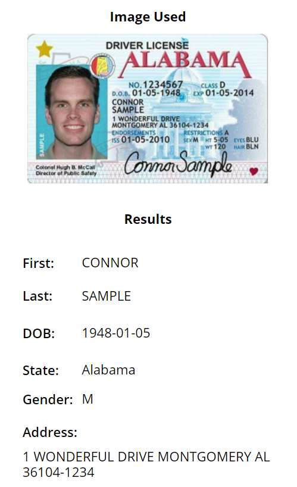
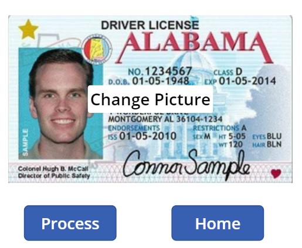

# AI Builder Drivers License Canvas App

This demo showcases how to use AI Builders prebuilt drivers license model to extract fields from any valid US issued drivers license.

## Prereq's

* AI Builder capacitiy credits
	* You can get these through either an AI Builder capacity add on license or through Power Automate Per User with Attended RPA licenses
* A Power Platform environment

## Setup Notes
1. Download the sample solution file here,

	[AI Builder Samples](https://github.com/microsoft/Federal-Business-Applications/raw/main/demos/ai-builder-drivers-license/files/AIBuilderSamples_1_0_0_3.zip)

2. Import the solution into your Power Platform environment

3. Run the DriversLicenseCanvasApp app in the solution

4. You can either add an existing image from your device, or you can use your camera to take a photo of a drivers license

	

5. If you add an existing photo, you can find sample drivers licenses can be found here for each state in the United States,

	[Sample US Drivers License Photos](https://github.com/microsoft/Federal-Business-Applications/raw/main/demos/ai-builder-drivers-license/files/SampleDriversLicenses.zip)

	> Note, these sample drivers licnese images were obtained from the following site,
	> 
	> https://www.insider.com/what-drivers-license-looks-like-in-every-state

	

6. Processing the image will show you the results page that includes the fields it pulled, the values and the associated confidence scores of the results.

	
