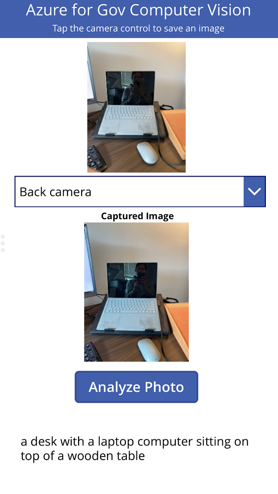
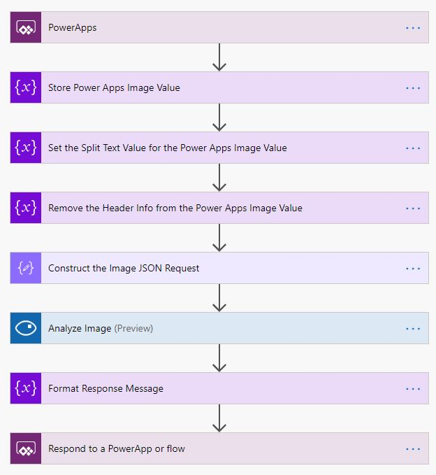
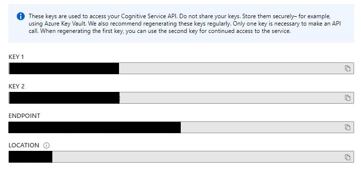
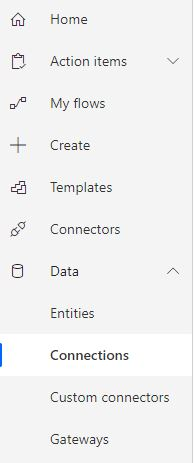
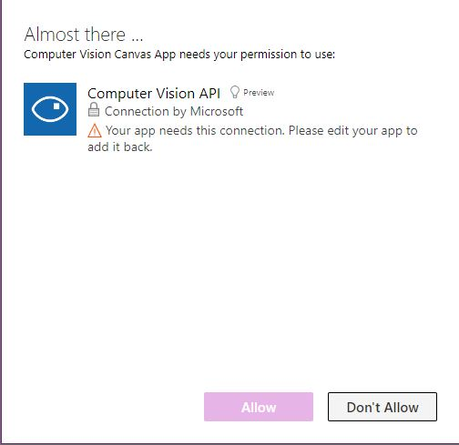
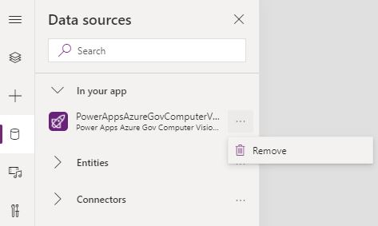
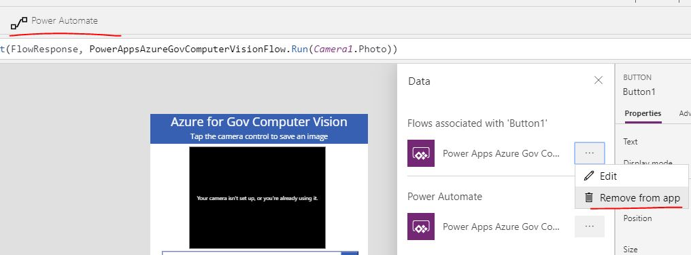
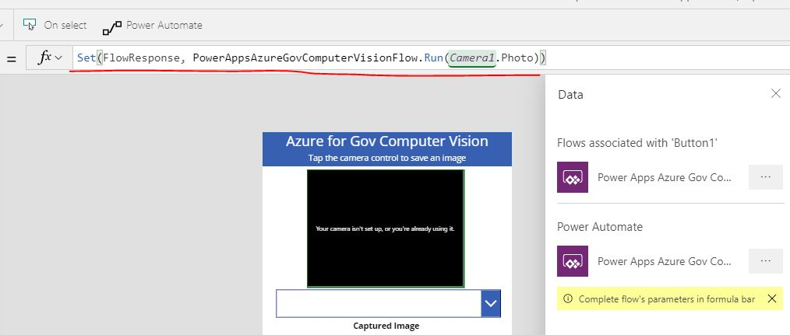

# Azure Computer Vision Sample App
This demo shows how to integrate Azure Cognitive Services AI/ML services with the Power Platform.  Specifically this sample uses the Computer Vision API. 

https://azure.microsoft.com/en-us/services/cognitive-services/computer-vision/

This sample works in commercial, GCC, GCC High and DoD environments of Power Platform.  This also works with Computer Vision APIs in both commercial Azure and Azure for Government.



## Computer Vision API Connector
This sample uses the Computer Vision API connector which you can read more about in the documentation below,

https://docs.microsoft.com/en-us/connectors/cognitiveservicescomputervision/

## Power Automate Flow
In order to response to a button action in Power Apps, I created a Power Automate Flow that takes input parameters from a Power Apps Canvas app.  The Flow looks like this,



## Power Apps Canvas App
This app leverages the Power Apps camera control which is built into the platform.  It also takes advantage of calling  Power Automate Flow from a Canvas app to pass an image to the Azure Computer Vision API.

The end result is a blurb of the Computer Vision API's caption of how it interprets the image.

## Sample Solution
The sample solution file for this demo can be found below,

[Computer Vision Sample Solution](files/ComputerVisionGCC_1_0_0_6.zip)

To get this up and running in your environment follow the steps below.

1. Create a Computer Vision resource in your Azure subsription. 

https://azure.microsoft.com/en-us/services/cognitive-services/computer-vision/

2. Under Keys and Endpoint copy the access key and the endpoint URL for your Computer Vision service.



3. Go to your Power Apps environment.
4. Create a new Connection for the Computer Vision API using the credentials from step 2.



5. Import the sample ComputerVisionGCC solution file.
6. Edit the Power Apps Azure Gov Computer Vision Flow and expand the Computer Vision action step.  Add the Computer Vision connection you added in step 4.
7. Edit the Computer Vision Canvas App.  You will get prompted for a connection to Computer Vision.  Ignore this warning by clicking Don't Allow.  Once you reconfigure the Power Automate Flow connection in the later steps this will no longer show up.



8. Remove the Power Automate Flow connection.  



9. Click on the Analyze Image button and remove the existing Flow connection if it shows up.



10. Add the Power Apps Azure Gov Computer Vision Flow to the button.  



Update the formula bar to include the following syntax,

````
Set(FlowResponse, PowerAppsAzureGovComputerVisionFlow.Run(Camera1.Photo))
````

11. Save and publish the app to use it both in the browser and on your mobile device!