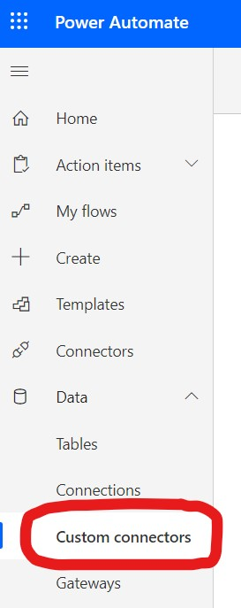
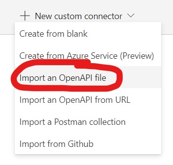
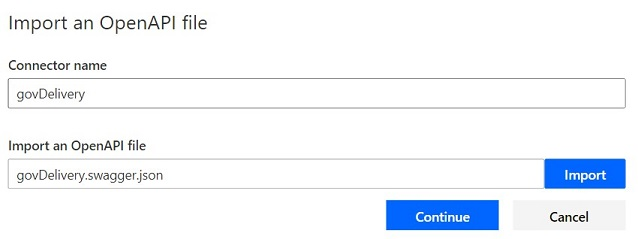
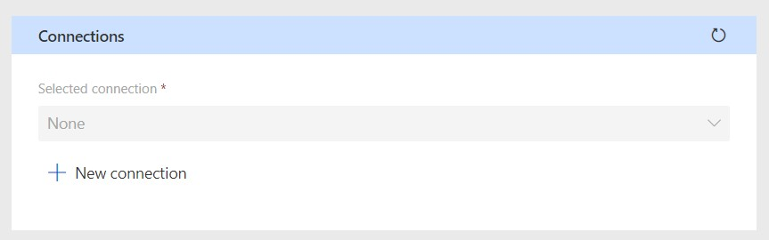
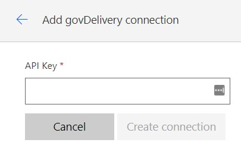
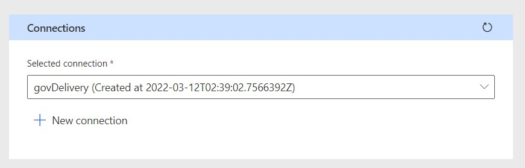
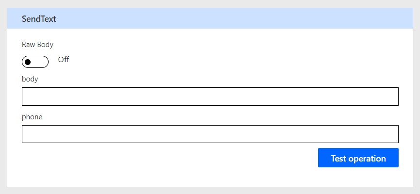
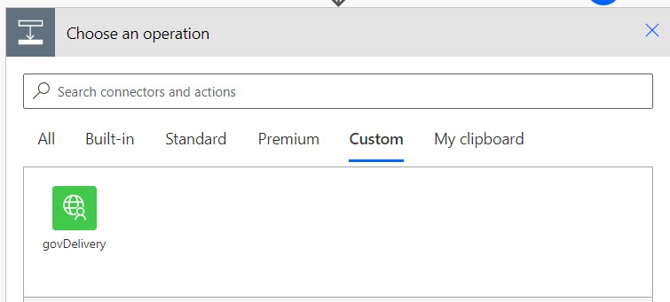
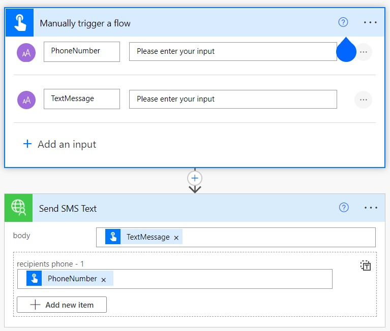

# govDelivery Custom Connector
This sample shows how easy it is to get started using govDelivery with Power Platform.  To get started you will need to have a govDelivery account and also an API key.  Details on govDelivery's APIs can be found below,

[govDelivery API Docs](https://developer.govdelivery.com/api/tms/overview/Setup/)

## Installing the Custom Connector
We have created a sample custom connector to make it incredibly easy to get started with govDelivery.

To install the custom connector, download the following swagger OpenAPI connection file,

[govDelivery Swagger Definition File](files/govDelivery.swagger.json)

Next, go to Power Automate > Data > Custom Connectors.



Next, create a new custom connector from an OpenAPI file,



Import the ```govDelivery.swagger.json``` you downloaded previously.  Name the connector ```govDelivery```



Click on "Create connector".  Now go to Test and then create a new connection,



You will need to then input the API key assigned from govDelivery,



Refresh the connections and you should now see the new connection you just created,



Now you can test the connector by sending SMS text messages or emails!



You can also now use this custom connector in any Power Automate Flows in the environment you installed the custom connector in,



Below is a sample Flow using the custom connector,

