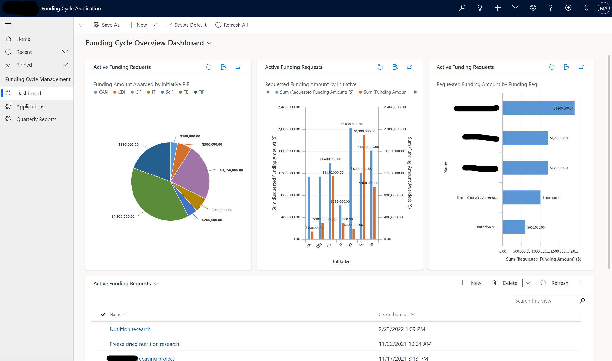
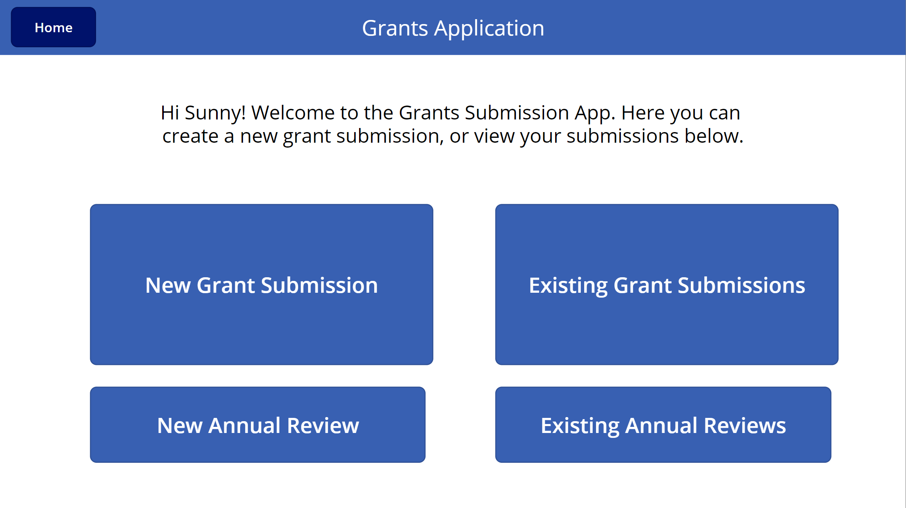
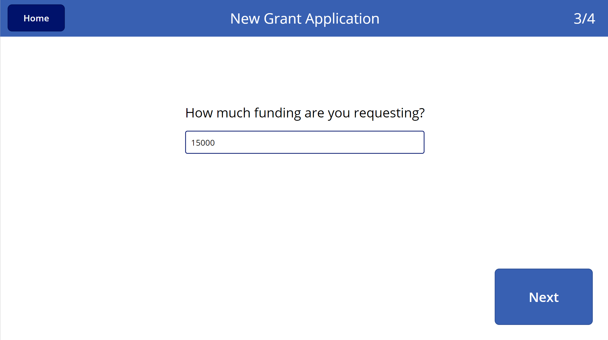
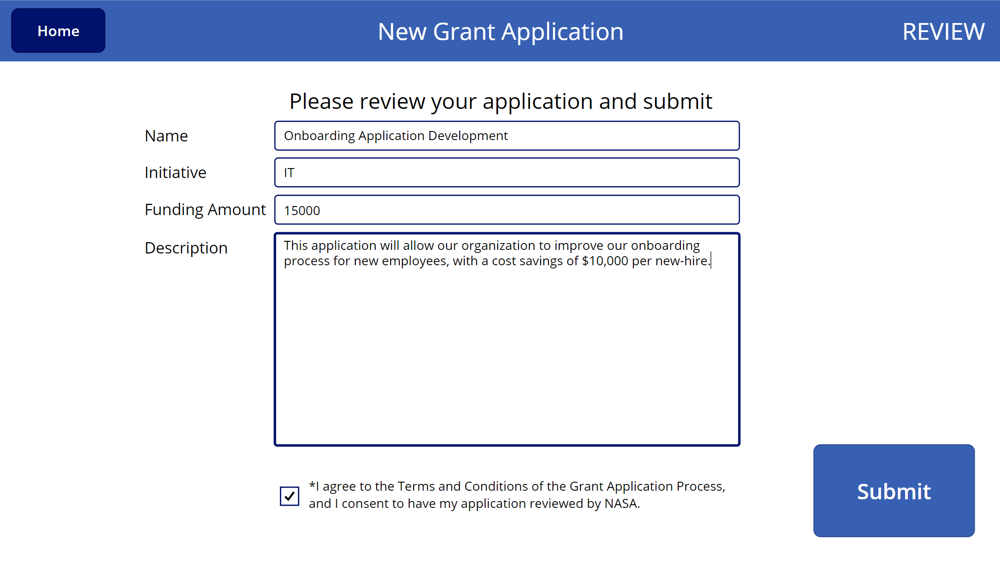

# Grants Managements Power App

This demo showcases how PowerApps can be utilized to build an enterprise-scale grants management system. 

This application consists of 2 parts: 
1. Front end Canvas app that allows users to submit and edit grant requests.
2. Back end Model-driven app that allows management to process submitted requests.

## Story Overview 
Note: End user only uses front-end app, approvers only use back-end app.
>1. User submits a grant request
>2. Manager views request, asks user to upload documentation.
>3. User revisits application and uploads documentation.
>4. Manager reviews application and approves 
>5. Move grant through BPF to Funded stage
>6. User submits a Quarterly Report
>7. Manager reviews Quarterly Report
>8. Leadership has visibility across dashboards, grant requests, and quarterly reports submitted by users 

## Screenshots

_Back-end Model-driven app dashboard for approvers/leadership._

_Front-end Canvas app for grant request submissions - Home._

_Handheld, step-by-step grant submission process._

_Submission review with attestation._