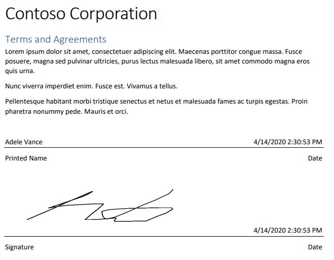
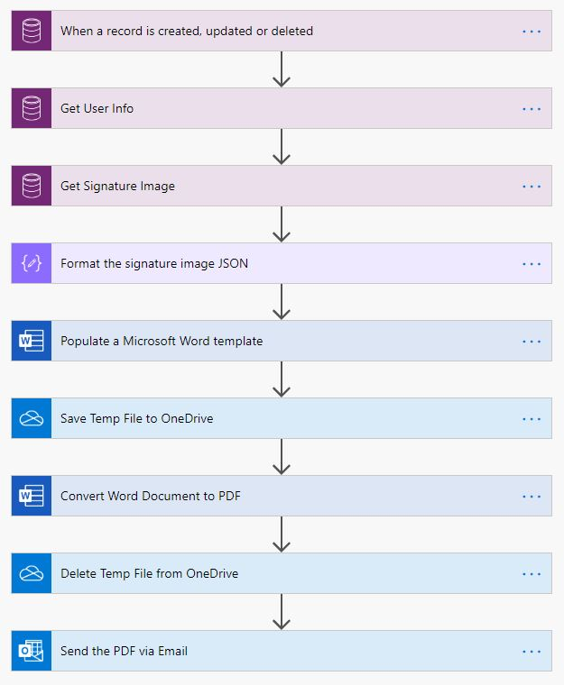
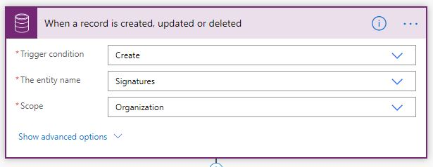
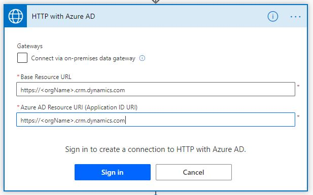
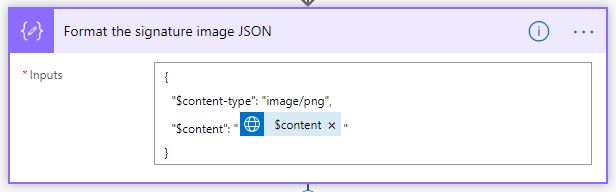
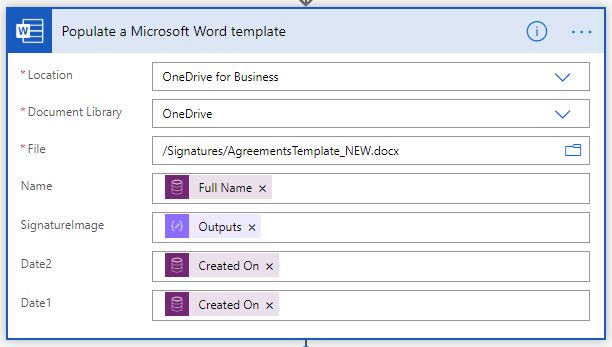
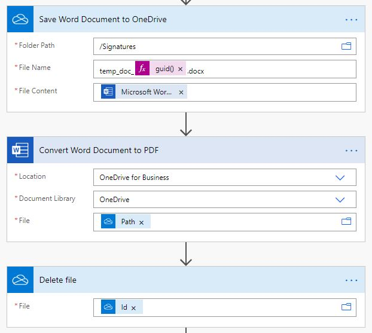
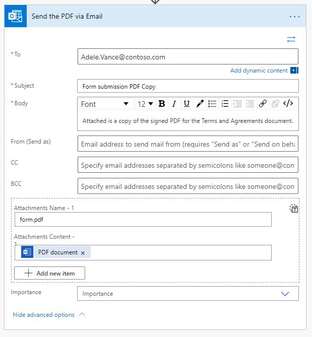
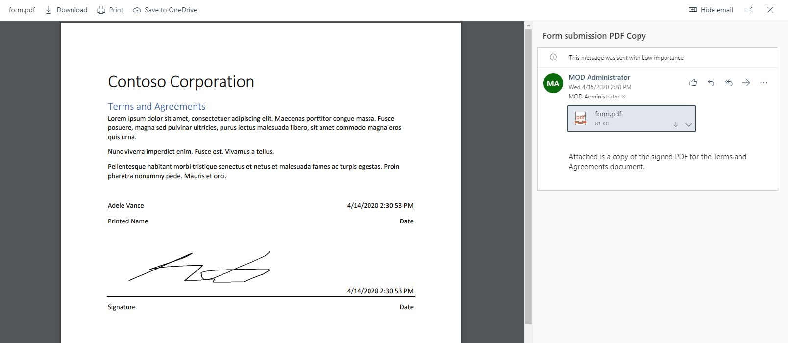

# Signed Form Generation from Word Templates
This example builds on the Electronic Signatures Demo app [Electronic Signatures Demo App](../electronic-signatures/README.md).  This explains how you can capture an electronic signature in a canvas app and then populate that into a Word template and create a PDF of the signed form.  

## Power Automate Flow Overview
Here is an outline of how you can accopmlish this using the data from the [Electronic Signatures Demo App](../electronic-signatures/README.md).  This Flow is triggered when a new Signature Dataverse record is created.  The signature image is downloaded, and then it is populated into a Word template file which is then exported to a PDF and sent to an email address.

## Word Templates Overview
Word templates with control types have been around for many years.  You can use them to standarize reports for your organization. Below is a link to read more about them,

[Create Word Templates with Content Controls](https://support.office.com/en-us/article/create-forms-that-users-complete-or-print-in-word-040c5cc1-e309-445b-94ac-542f732c8c8b?ui=en-US&rs=en-US&ad=US)

Power Apps and Dyanmics support Word Template files to create reports off of entities in Dataverse.  To date, those templates do not support image control types in Word templates.  

[Word Templates with D365](https://docs.microsoft.com/en-us/power-platform/admin/using-word-templates-dynamics-365)

So for this example, we cannot use that feature.  Instead, we will use the [Word Online (Business) connector](https://docs.microsoft.com/en-us/connectors/wordonlinebusiness/).  This connector has support for many of the content control types that you can create in Word.

[Supported Content Controls](https://docs.microsoft.com/en-us/connectors/wordonlinebusiness/#currently-supported-content-controls)

## Setup
Create a Word template as described above.  Next, add the template file to a location in your OneDrive for Business account.  Lastly, make sure you have the [Electronic Signatures Demo App](../electronic-signatures/README.md) running in your environment.

## Creating the Flow

### Trigger
Create a new Flow with the trigger using the [Common Data Service](https://docs.microsoft.com/en-us/Connectors/commondataserviceforapps/#when-a-record-is-created,-updated-or-deleted) connector when a new Signature entity is created.

### Get Created By User Name
Add a new action to get the display name of the user who created the entity.  This is using the [Common Data Service](https://docs.microsoft.com/en-us/Connectors/commondataserviceforapps/#get-a-record) connector to get a record.

### Download the Signature Image
The Pen Input result from the [Electronic Signatures Demo App](../electronic-signatures/README.md) was stored using the [File field type in Dataverse](https://docs.microsoft.com/en-us/powerapps/developer/common-data-service/file-attributes).  You could also use the [new Image field type](https://docs.microsoft.com/en-us/powerapps/developer/common-data-service/image-attributes) that supports full images too.

Use the [Get file or image content](https://docs.microsoft.com/en-us/connectors/commondataserviceforapps/#get-file-or-image-content) action.

### Download the Signature Image (alternate approach)
The alternative to using the above action is the use the HTTP with Azure AD connector.

Now we need to configure the action itself.  Make a GET request to download the signed signature image using the base OData URL and the unique ID of the Signature entity as variables,

### Format the JSON Response
The Word template action requires a specfiic format for image control types.  This action formats the download response properly.

### Populate the Word Template
Add a new action to Populate a Microsoft Word template.  Find the template file you created eariler and uploaded to OneDrive and configure this action.  Once you tell it the file you want to you use, you should now see each content control field available as inputs to the action step.  

### Export the Word result as a PDF
Now we want to use the Convert Word Document to PDF action.  In order to use this, we first have to save the previous result to OneDrive to a temporary file location.  We can also delete the temporary file after we create the PDF file.  One thing to note here.  The [Word Online (Business) connector](https://docs.microsoft.com/en-us/connectors/wordonlinebusiness/) needs a file path to reference a file in OneDrive while the [OneDrive for Business connector](https://docs.microsoft.com/en-us/Connectors/onedriveforbusiness/) uses the unique identifier.

### Email the PDF
Finally we can email the copy of the generated PDF file.  Below is the setup for this,

## Final Result
Putting this all together, when we create a new Signature entity we now receive an email to with the attached and signed PDF form.

## Setting up the Sample Solution
Below is the sample solution you can install in your Dataverse environment to test this.  

[Electronic Demo Solution File](files/ElectronicSignatureDemo_1_0_0_6.zip)

Once installing the solution you need to run the following steps,

Run the "SetupOneDrive" Flow manually.  You will need to re-establish the OneDrive connection.  This creates a template Word document in the root of your OneDrive environment (/Signatures/AgreementsTemplate_NEW.docx).  This is used by the Flow that creates the PDF file.

Edit the "Power Apps Word Template Generation" Flow.  You will need to re-establish the connections to the various services it uses.  Enable the Flow and then create a new Signature record using the Signature Canvas App.  Then you can wait for the email to show up in the inbox that contains the PDF file.
