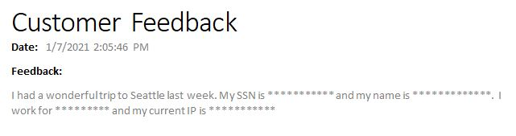

# PII Redaction with Power Automate

This demo highlights how you can use Power Automate with Azure Cognitive Services Text Analytics PII redaction feature.  There is also a corresponding YouTube video that shows how to build and install the sample solution.

[PII & Power Automate YouTube Video](https://youtu.be/2kQRx-aqyhk)

The Word document that gets generated from a sample text input of 

> I had a wonderful trip to Seattle last week. My SSN is 123-43-1234 and my name is Steve Winward.  I work for Microsoft and my current IP is 103.1.0.104

is below =>

# Sample Redaction Flow
Below is a link to download the sample solution file that inclues the Redaction Cloud Flow.

https://github.com/microsoft/Federal-Business-Applications/raw/main/demos/ai-builder-drivers-license/files/RedactionDemo_1_0_0_1.zip

Also, below is a link to a Word document that has content control types added which are used in the Flow sample.

https://github.com/microsoft/Federal-Business-Applications/raw/main/demos/ai-builder-drivers-license/files/SurveyTemplate.docx

# Requirements
* An Azure subscription.
* A Power Automate Per User license (not the seeded O365 license).  You can get a 30 day free trial to use instead.

# Setup
* Create an Azure Text Analytics resource in your Azure subscription.
* Download the sample Word document and upload that to your OneDrive.
* Import the [sample solution file](https://github.com/microsoft/Federal-Business-Applications/raw/main/demos/ai-builder-drivers-license/files/RedactionDemo_1_0_0_1.zip).  
* Once imported, go to the Redaction Cloud Flow
* Edit the flow and then update the connections for the Word for Business and Outlook actions

[Connector Error Messages](files/ConnectionError.PNG)

* Update the Word for Business action to point to the file path you uploaded the [SurveyTemplate.docx](files/SurveyTemplate.docx) file

* Update the Text Analytics URL and the Text Analytics API Key to use your instance of the Text Analytics service.

[Text Analytics Config](files/TextAnalyticsConfiguration.PNG)

* Save and test the Flow