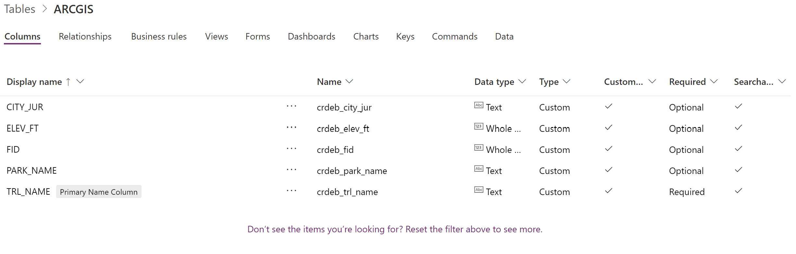
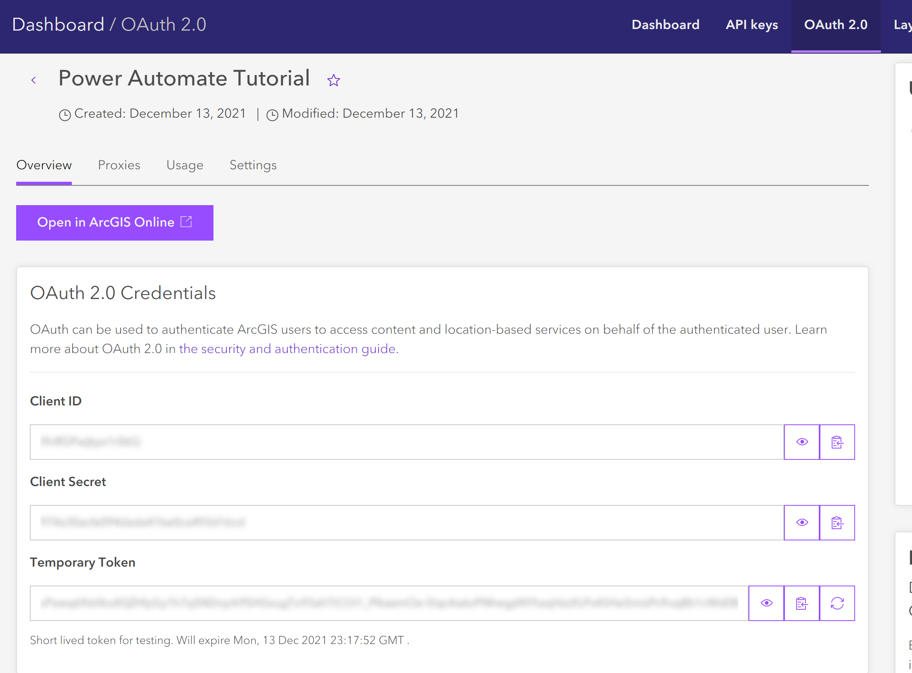
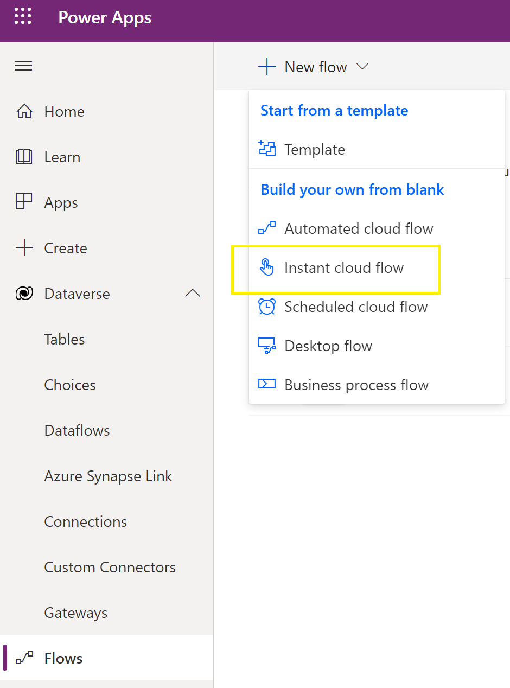
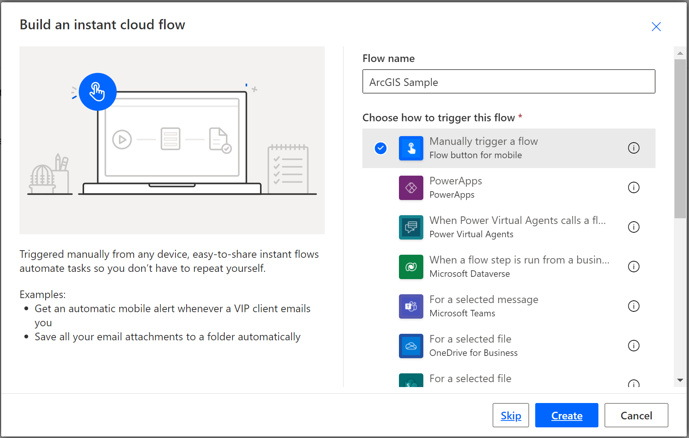
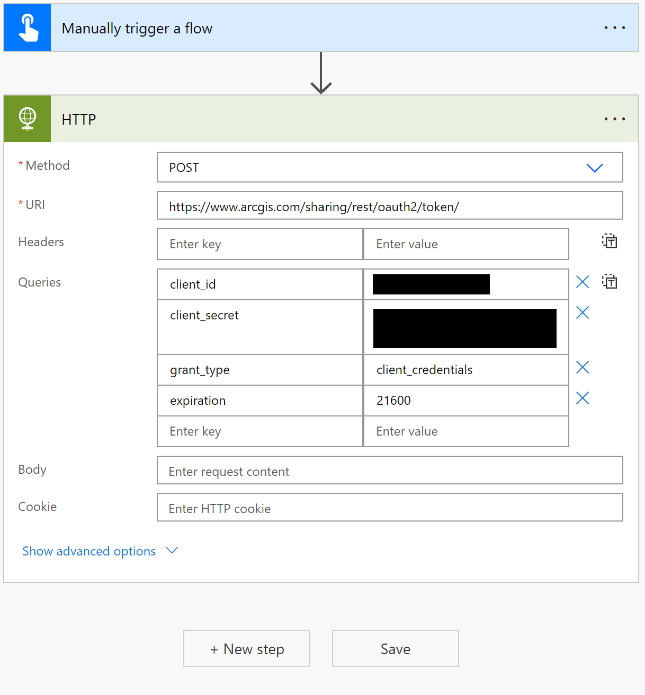
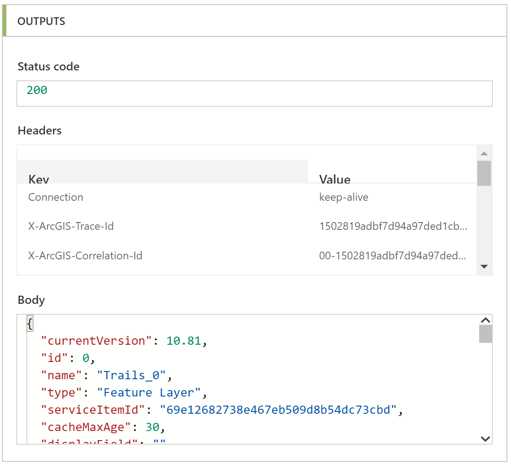
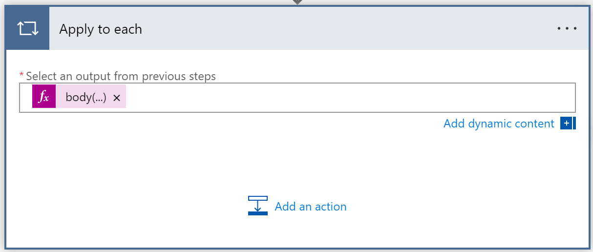
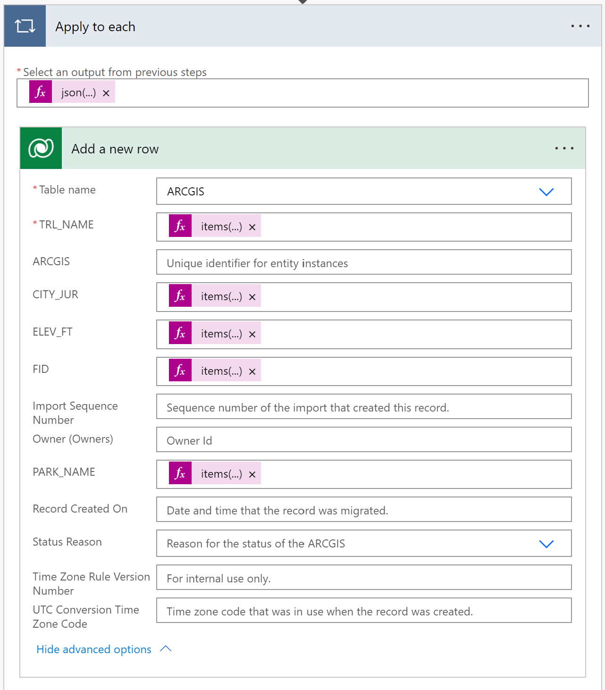

# Populating Dataverse with ArcGIS Feature Service Data

## Overview

This document will describe one method of using Microsoft Power Automate to query the ArcGIS Feature Service REST API and load the resulting data into a Dataverse table.  It assumes the reader is comfortable with querying the ArcGIS REST API and with creating Flows in Power Automate.  Further information on the ArcGIS REST API can be found in the [ArcGIS REST API Documentation](https://developers.arcgis.com/rest/).  Further information on Power Automate can be found in the [Power Automate Documentation](https://docs.microsoft.com/en-us/power-automate/).

The document describes the process in three parts.
#### Obtain an OAUTH 2.0 authentication token from the ArcGIS web service.  
An OAUTH 2.0 token is required to access secured ArcGIS resources.  As of this writing, the default lifespan of the ArcGIS OAUTH 2.0 tokens is two hours with a configurable maximum lifespan of two weeks.  In order to make sure our flow has a valid token, we will configure the flow to obtain a new token automatically each time it runs.  The API calls for this part of the process are outlined in the [ArcGIS OAUTH documentation](https://developers.arcgis.com/documentation/mapping-apis-and-services/security/oauth-2.0/).

#### Connect to the Feature Service and query Feature attributes.  
We will connect to the ArcGIS Feature Service sample endpoint and return an array of Trails.  For each Trail, we will return the following attributes:  TRL_NAME, TRL_ID, LENGTH_FT, USE_BIKE, and USE_HIKE, and load them into a Dataverse Table.  The API calls for this part of the process are outlined in the [ArcGIS Feature Layer API Documentation](https://developers.arcgis.com/labs/rest/query-a-feature-layer/).

#### Load Epoch data Types from ArcGIS into the Common Data Service.
The ArcGIS Feature Service can return dates in Epoch format (number of milliseconds since 1/1/1970).  [Epoch format details](https://en.wikipedia.org/wiki/Unix_time).  These data types may need to be converted before being loaded into a Dataverse Table.  This document will discuss strategies for loading Epoch data types.

## Prerequisites

### ArcGIS Developer Account
To complete the first section, you will need an ArcGIS Developer account.  If you do not have one, you can create an ArcGIS Developer account at the [ArcGIS Developer Signup Page](https://developers.arcgis.com/sign-up/)

### ArcGIS Application
To complete the second section, you will need to have a registered Application in ArcGIS.  If you do not have an Application you can create one by following steps 1-4 in the [ArcGIS Documentation](https://developers.arcgis.com/labs/rest/get-an-access-token/)

### Create a Table to Store Data
We will query the service for information about trails.  To store this information, create an Table called ArcGIS in Dataverse with the custom fields below.  Note that the Primary Name field should be TRL_NAME:

| Field Name | Data Type |
| --------- | :---: |
| TRL_NAME | Text |
| LENGTH_FT | Whole Number |
| TRL_ID | Whole Number |
| USE_BIKE | Text |
| USE_HIKE | Text |

## Step by Step Example  

1.	To obtain an OAUTH 2.0 token, you will need the Client ID and Client Secret for your Application.  These can be found in the OAUTH 2.0 area of your Dashboard as shown in the screenshot below. 

2.	In the Power Apps Maker portal, create a new Instant Cloud Flow. 

3.	Name the Flow ArcGIS Sample and set the trigger to Manually trigger a flow. 

4.	Add an HTTP action and configure it as shown below, using your Client ID and Client Secret from Step 1.  We will set the expiration parameter to 21600.  This will return a token with a six-hour lifespan. 

| Field Name | Value |
| --------- | :---: |
| Method | POST |
| URL | https://www.arcgis.com/sharing/rest/oauth2/token/ |
| client_id | YOUR_CLIENT_ID_HERE |
| client_secret | YOUR_CLIENT_SECRET_HERE |
| grant_type | client_credentials |
| expiration | 21600 |

5.	Save and Test the flow.  Inspect the OUTPUTS area of the HTTP action and ensure the Status code is 200 and the Body contains an access_token as shown below. 

6.	Add another HTTP Action to the flow and configure it with the parameters shown below.    We will set the where parameter to filter the rows and return a subset of the data.  To pass the token we received in the previous step, we set the token parameter to the following expression: json(body('HTTP'))?[ 'access_token']. Note that the token is not required to run the sample query but will be required to access secured resources. 

| Field Name | Value |
| --------- | :---: |
| Method | POST |
| URL | https://services3.arcgis.com/GVgbJbqm8hXASVYi/arcgis/rest/services/Trails/FeatureServer/0/query |
| content_type | application/x-www-form-urlencoded |
| f | json |
| where | TRL_NAME like 'a%' |
| outSr | 4326 |
| outFields | * |
| outSr | 4326 |
| token | Expression: body('HTTP')?[ 'access_token'] |

7.	Save and Test the flow.  Inspect the OUTPUTS area of the HTTP_2 action and ensure the Status code is 200 and the Body contains the JSON object data as shown below. 

8.	Add an Apply to each action as shown below.  To iterate over each Feature returned by the query, we set the Select an output from previous steps field to the following expression: json(body('HTTP_2'))?['features']. 

9.	Add a Dataverse – Add a new row action to the Apply to each step as shown below.  Use the following expression syntax for each of the fields.

| Field Name | Expression |
| --------- | :---: |
| TRL_NAME | items('Apply_to_each')?['attributes']?['TRL_NAME']  |
| CITY_JUR | items('Apply_to_each')?['attributes']?['CITY_JUR']  |
| ELEV_FT | items('Apply_to_each')?['attributes']?['ELEV_FT']  |
| FID | items('Apply_to_each')?['attributes']?['FID']  |
| PARK_NAME | items('Apply_to_each')?['attributes']?['PARK_NAME']  |

10.	Save and Test the flow.  Inspect the OUTPUTS area of the first Create a new record action and ensure the attributes are being loaded with data as shown below. 

