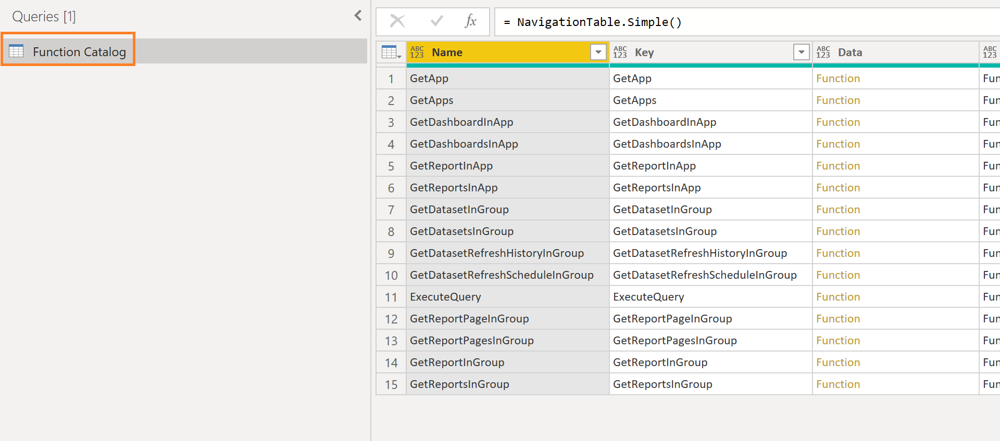

# Power Query Custom Data Connector for Power BI REST APIs (Government Community Cloud)

## Background
[On August 29th, 2021, Chris Webb, a Power BI specialist, wrote:](https://blog.crossjoin.co.uk/2021/08/29/connecting-to-rest-apis-with-oauth2-authentication-in-power-query-power-bi/) 

*"If want to connect from Power BI to a REST API that uses OAuth2 authentication then you need to build a custom connector."* 

With the release of the [Power Query SDK for Visual Studio Code](https://powerbi.microsoft.com/en-us/blog/power-query-sdk-for-visual-studio-code-public-preview/) in October of 2022, this opened the opportunity for more developers to build custom data connectors, especially those with OAuth2 authentication.

## Power BI REST API

The [Power BI REST API](https://learn.microsoft.com/en-us/rest/api/power-bi/) is a REST API that uses OAuth2 authentication and many Power BI project teams have needed a way to import information on datasets, reports, dashboards, and workspaces into a Power BI dataset automatically.  

An [open source custom data connector](https://github.com/kerski/powerquery-connector-pbi-rest-api-gcc/blob/main/README.md) for the Power BI REST API is available for GCC customers to try out. 

This Custom Data Connector wraps many of the "Get" endpoints in the Power BI API (with the exception of the /executeQueries endpoint), so that OAuth2 can be used to authenticate to the service.  This connector serves as a way to have a library of Power Query functions to build datasets based on the Power BI APIs without the need for storing client secrets or passwords in the dataset.  

Each function returns a JSON body and not a table of data.  This decision was made to provide flexibility in converting the JSON body to tabular data when 1) the API responses are changed by the Microsoft team or 2) the API responses differ between commercial and sovereign clouds (e.g., GCC, DoD, etc.).

For more information on using this custom data connector, [please see this link](https://github.com/kerski/powerquery-connector-pbi-rest-api-gcc/blob/main/README.md).