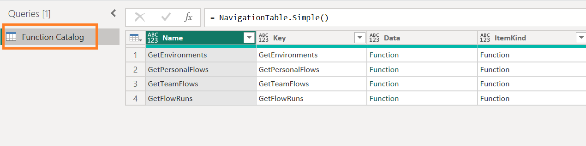

# Power Query Custom Data Connector for Power Automate REST APIs (Government Community Cloud)

## Background

With the release of the [Power Query SDK for Visual Studio Code](https://powerbi.microsoft.com/en-us/blog/power-query-sdk-for-visual-studio-code-public-preview/) in October of 2022, this opened the opportunity for more developers to build custom data connectors, especially those with OAuth2 authentication.

## Power Automate REST API

The Power Automate REST API uses OAuth2 authentication and many Power BI project teams have needed a way to import information on Power Automate flows because project teams rely on Power Automate to deliver features such as:

1. Scheduling Refreshes - If you're working with Power BI premium capacities, Power Automate allows you to schedule more than the 30-minute refreshes provided with the dataflow and dataset scheduling interface found in the Power BI service. 
2. Delivering Content - With a Power Automate connector to Power BI, you can deliver reports and notifications directly to customers making their experience with a data analytics solution that much better.
3. Moving Files - Power Automate can be used to copy files from one location to another.  Ultimately, these Power Automate flows serve to put data in a location for Power BI to ingest and transform.

An [open source custom data connector](https://github.com/kerski/powerquery-connector-power-automate-rest-api-gcc#readme) for the Power Automate REST API is available for GCC customers to try out. 

This Custom Data Connector wraps a few of the "Get" endpoints in the Power Automate API, so that OAuth can be used to authenticate to the service. This connector serves as a way to have a library of Power Query functions to build datasets based on the Power Automate APIs without the need for storing client secrets or passwords in the dataset.

Each function returns a JSON body and not a table of data. This decision was made to provide flexibility in converting the JSON body to tabular data when 1) the API responses are changed by Microsoft or 2) the API responses differ between commercial and sovereign clouds (e.g., GCC, DoD, etc.).

For more information on using this custom data connector, [please see this link](https://github.com/kerski/powerquery-connector-power-automate-rest-api-gcc#readme).