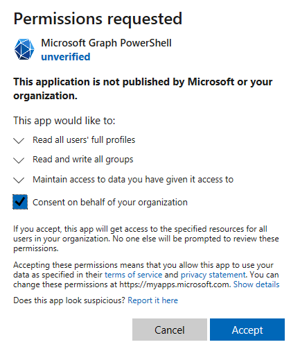

# PowerShell for US Government Samples
Below are samples to connect to US Government O365 environments (GCC, GCC High and GCC DoD) using various PowerShell modules.

## Power BI Admin Module

https://docs.microsoft.com/en-us/powershell/power-bi/overview?view=powerbi-ps

If you have not already done so, install the Power BI Admin module for PowerShell.  Note that you need to run this as an administrator.

```powershell
Install-Module -Name MicrosoftPowerBIMgmt
```

If you have already installed it, make sure to update to the latest version

```powershell
Update-Module -Name MicrosoftPowerBIMgmt
```

To connect to a Power BI environment in a US Government O365 Environment,

```powershell
# Login for GCC Moderate
Login-PowerBI -Environment USGov

# Login for GCC High
Login-PowerBI -Environment USGovHigh

# Login for GCC DoD
Login-PowerBI -Environment USGovMil
```

## Azure AD

https://docs.microsoft.com/en-us/office365/enterprise/powershell/connect-to-office-365-powershell#step-2-connect-to-azure-ad-for-your-office-365-subscription

If you have not already done so, install the Azure AD Module.  Note that you need to run this as an administrator.

```powershell
Install-Module -Name AzureAD
```

If you have already installed it, make sure to update to the latest version

```powershell
Update-Module -Name AzureAD
```

```powershell
# Login for GCC Moderate
Connect-AzureAD

# Login for GCC High / GCC DoD
Login-PowerBI -Environment AzureUSGovernment
```

## MSOnline

https://docs.microsoft.com/en-us/powershell/azure/active-directory/overview?view=azureadps-1.0

If you have not already done so, install the ```MSOnline``` Module.  Note that you need to run this as an administrator.

```powershell
Install-Module -Name MSOnline
```

If you have already installed it, make sure to update to the latest version

```powershell
Update-Module -Name MSOnline
```

Authentication examples,

```powershell
# Commercial and GCC
Connect-MsolService

# GCC High and DOD
Connect-MsolService -AzureEnvironment AzureUSGovernmentCloud
```

Sample resetting default service plan options for the O365 E3 license,

```powershell
# Set this to the actual UPN you want to run this against
$UserPrincipalName = "<INPUT_ACTUAL_UPN_HERE>";

# Lookup the E3 SKU ID in the tenant
$SKU = (Get-MsolAccountSku | where {$_.AccountSkuId -like '*E3*'}).AccountSkuId

# get all the default service plans for the E3 SKU
# this is only for troubleshooting if you want to see the individual service plans
# $ServicePlans = ((Get-MsolAccountSku | Where-Object {$_.AccountSkuId -eq $SKU}).ServiceStatus | Select-Object ServicePlan -ExpandProperty ServicePlan)

$LicOptions = New-MsolLicenseOptions -AccountSkuId $SKU

# remove the license with the existing settings
Set-MsolUserLicense -UserPrincipalName $UserPrincipalName -RemoveLicenses $SKU

# add the license back with the default service plan settings (which inlcudes power apps and power automate)
Set-MsolUserLicense -UserPrincipalName $UserPrincipalName -AddLicenses $SKU -LicenseOptions $LicOptions
```

## Power Apps

https://docs.microsoft.com/en-us/power-platform/admin/powerapps-powershell

To install the Power Apps modules, run the following.  Note that you need to run this as an administrator.

```powershell
Install-Module -Name Microsoft.PowerApps.Administration.PowerShell
Install-Module -Name Microsoft.PowerApps.PowerShell -AllowClobber
```

If you have already installed it, make sure to update to the latest version

```powershell
Update-Module -Name Microsoft.PowerApps.Administration.PowerShell
Update-Module -Name Microsoft.PowerApps.PowerShell
```
Examples for GCC and GCC High below,
```powershell
# Add an account in GCC Moderate
Add-PowerAppsAccount -Endpoint "usgov" 

# Add an account in GCC High
Add-PowerAppsAccount -Endpoint "usgovhigh"

# Add an account in DOD
Add-PowerAppsAccount -Endpoint "dod"
```

## Power Apps Command Line Interface (PAC Tool)

Details on the PAC tool can be found below (including install steps)

https://docs.microsoft.com/en-us/powerapps/developer/data-platform/powerapps-cli

Examples to use with GCC.  GCC High and DOD are not supported yet with PAC tool (as of 6/10/2021).  Open GitHub issue for this below,

https://github.com/microsoft/powerplatform-actions/issues/73

```powershell
# GCC authentication with AAD application id and secret
pac auth create --name gcc --kind CDS --url <INPUT_ENVIRONMENT_URL> --applicationId <AAD_APP_ID> --clientSecret <AAD_APP_SECRET> --tenant <AAD_TENANT_ID> --cloud UsGov

# GCC authentication with AAD username and password
pac auth create --name gcc --kind CDS --url <INPUT_ENVIRONMENT_URL> --username <USERNAME@CONTOSO.COM> --password <PASSWORD> --cloud UsGov

```

## Exchange Online

https://docs.microsoft.com/en-us/powershell/exchange/exchange-online/connect-to-exchange-online-powershell/connect-to-exchange-online-powershell?view=exchange-ps

```powershell
# Set the user credentials
$userCredential = Get-Credential

# Setup the session (GCC Moderate)
$Session = New-PSSession -ConfigurationName Microsoft.Exchange -ConnectionUri https://outlook.office365.com/powershell-liveid/ -Credential $UserCredential -Authentication Basic -AllowRedirection

# Setup the session (GCC High)
$Session = New-PSSession -ConfigurationName Microsoft.Exchange -ConnectionUri https://outlook.office365.us/powershell-liveid/ -Credential $UserCredential -Authentication Basic -AllowRedirection

# Setup the session (GCC DoD)
$Session = New-PSSession -ConfigurationName Microsoft.Exchange -ConnectionUri https://webmail.apps.mil/powershell-liveid/ -Credential $UserCredential -Authentication Basic -AllowRedirection

# Import the session
Import-PSSession $Session -DisableNameChecking

```

## Exchange Online with Multi-Factor Authentication (MFA)

https://docs.microsoft.com/en-us/powershell/exchange/exchange-online/connect-to-exchange-online-powershell/mfa-connect-to-exchange-online-powershell?view=exchange-ps

```powershell
# Set the UserPrincipalName
$upn = <john@contoso.com> # set this to your actual UPN

# GCC
Connect-EXOPSSession -UserPrincipalName $upn

# GCC High
Connect-EXOPSSession -UserPrincipalName $upn -ConnectionUri https://outlook.office365.us/powershell-liveid -AzureADAuthorizationEndPointUri https://login.microsoftonline.us/common

# GCC DoD
Connect-EXOPSSession -UserPrincipalName $upn -ConnectionUri https://webmail.apps.mil/powershell-liveid -AzureADAuthorizationEndPointUri https://login.microsoftonline.us/common

```

## Teams
https://docs.microsoft.com/en-us/powershell/module/teams/connect-microsoftteams?view=teams-ps

If you have not already done so, install the Power BI Admin module for PowerShell.  Note that you need to run this as an administrator.

```powershell
Install-Module -Name MicrosoftTeams
```

If you have already installed it, make sure to update to the latest version

```powershell
Update-Module -Name MicrosoftTeams
```
Examples for GCC, GCC High and GCC DoD are below
```powershell
# GCC
Connect-MicrosoftTeams

# GCC High
Connect-MicrosoftTeams -TeamsEnvironmentName "TeamsGCCH"

# GCC DoD
Connect-MicrosoftTeams -TeamsEnvironmentName "TeamsDOD"
```

## Microsoft Graph PowerShell

Installation notes can be found on the public docs below,

https://docs.microsoft.com/en-us/graph/powershell/installation

Connecting to the Graph API with user delegated permissions,

https://docs.microsoft.com/en-us/graph/powershell/get-started

```powershell
# GCC
Connect-MgGraph

# GCC High
Connect-MgGraph -Environment USGov

# DOD
Connect-MgGraph -Environment USGovDoD
```
> NOTE: Using the delegated permissions you will still need an admin to grant consent to the scopes you want to run for the tenant.  
> Example of this running as an admin is below,



Connecting to the Graph API with Azure Active Directory Application identities (i.e. app-only authentication) are below,

https://docs.microsoft.com/en-us/graph/powershell/app-only?tabs=azure-portal

```powershell
# GCC
Connect-MgGraph -ClientID YOUR_APP_ID -TenantId YOUR_TENANT_ID -CertificateName YOUR_CERT_SUBJECT

# GCC High
Connect-MgGraph -Environment USGov -ClientID YOUR_APP_ID -TenantId YOUR_TENANT_ID -CertificateName YOUR_CERT_SUBJECT

# DOD
Connect-MgGraph -Environment USGovDoD -ClientID YOUR_APP_ID -TenantId YOUR_TENANT_ID -CertificateName YOUR_CERT_SUBJECT
```
