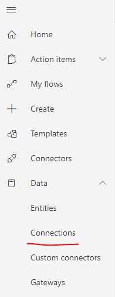
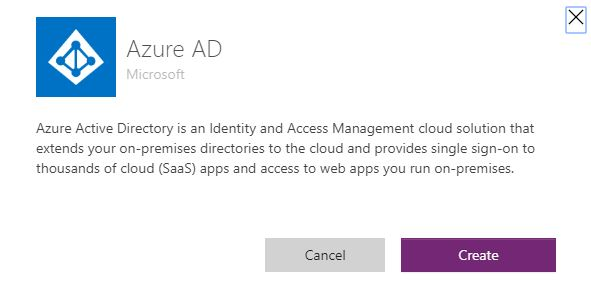
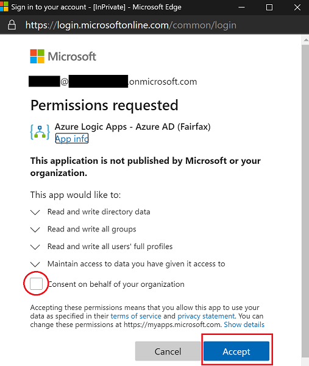

# Enable Azure AD Connector in GCC
To use the Azure AD connector in GCC a Global Admin in your tenant needs to first consent for the organization to be able to use the connector.  

Below are the docs on the Azure AD connector for the Power Platform,

https://docs.microsoft.com/en-us/connectors/azuread/

Below are the steps to enable this for a tenant.

* Go to the Power Automate service
* Go to the Connections page (Data > Connections)

* Create a new connection
* Find the Azure AD connector and create a new connection

* Sign in with your Global Admin credentials and make sure to check the box for the entire organization

Once this is done, any user in the tenant can now use the Azure AD connector in the Power Platform.

## Alternative to Azure AD Connector
An alternative to using the Azure AD connector for some scenarios is to use the O365 Groups connector.  This also does not require admin consent for other users to use this connector.

Docs to this connector are below,

https://docs.microsoft.com/en-us/connectors/office365groups/