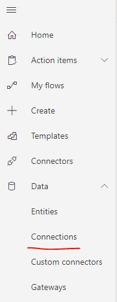
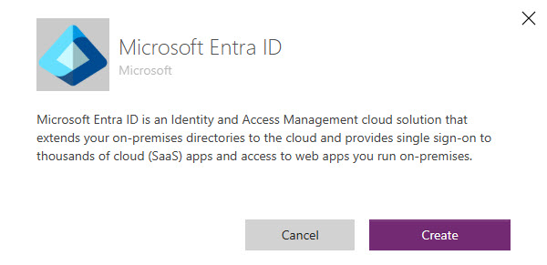
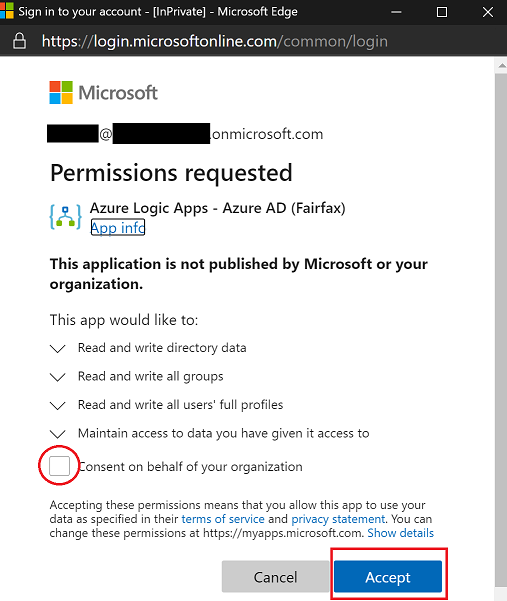

# Enable Microsoft Entra ID Connector in GCC
To use the Microsoft Entra ID connector in GCC a Global Admin in your tenant needs to first consent for the organization to be able to use the connector.  

Below are the docs on the Microsoft Entra ID connector for the Power Platform,

https://docs.microsoft.com/en-us/connectors/azuread/

Below are the steps to enable this for a tenant.

* Go to the Power Automate service
* Go to the Connections page (Data > Connections)

* Create a new connection
* Find the Microsoft Entra ID connector and create a new connection

* Sign in with your Global Admin credentials and make sure to check the box for the entire organization

Once this is done, any user in the tenant can now use the Microsoft Entra ID connector in the Power Platform.

## Alternative to Microsoft Entra ID Connector
An alternative to using the Microsoft Entra ID connector for some scenarios is to use the O365 Groups connector.  This also does not require admin consent for other users to use this connector.

Docs to this connector are below,

https://docs.microsoft.com/en-us/connectors/office365groups/
