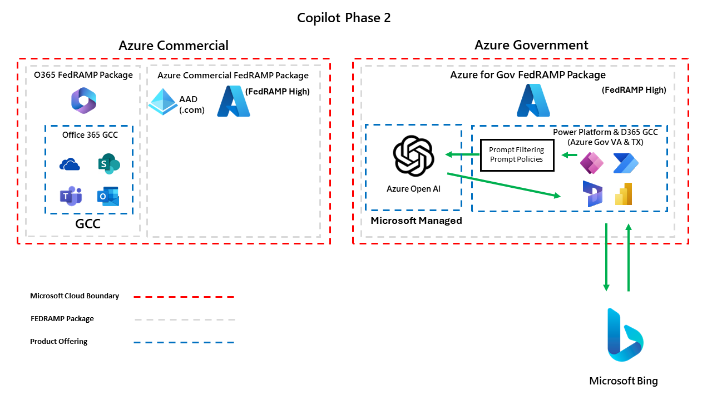

# Federal Copilot Resources for Microsoft Business Applications
> [!IMPORTANT]
> November 7, 2024 through Nov 12, 2024 we are going live with Phase 2 of Copilot availability for Power Platform and Dynamics 365 in GCC and GCC High!  More details below!

The goal of this whitepaper is to serve as a guide for all US Federal customers to understand how Copilot across US Government sovereign clouds is rolling out for Power Platform and Dynamics 365.  We also want to outline our Microsoft Responsible AI framework, demonstrate what security protections we put in place for end users and organizational data, as well as illustrate architecture diagrams of how all of this works.  

This document will continue to evolve as we roll out more features and functionality overtime.

## Responsible AI
Every Microsoft Business Applications service has their own dedicated Responsible AI page on our public documentation site.  Below we have summarized the links for all Power Platform and Dynamics 365 services and their associated Responsible AI page.

* [Power Platform](https://learn.microsoft.com/en-us/power-platform/responsible-ai-overview)
  * [AI Builder](https://learn.microsoft.com/en-us/ai-builder/responsible-ai-overview)
  * [Copilot Studio](https://learn.microsoft.com/en-us/microsoft-copilot-studio/responsible-ai-overview)
  * [Power Apps](https://learn.microsoft.com/en-us/power-apps/maker/common/responsible-ai-overview/)
  * [Power Automate](https://learn.microsoft.com/en-us/power-automate/responsible-ai-overview/)
  * [Power Pages](https://learn.microsoft.com/en-us/power-pages/responsible-ai-overview/)
* [Dynamics 365](https://learn.microsoft.com/en-us/dynamics365/responsible-ai-overview)
  * [Dynamics 365 Customer Service](https://learn.microsoft.com/en-us/dynamics365/customer-service/implement/responsible-ai-overview)
 
## Azure OpenAI
Azure OpenAI is the service that all Copilot features are built upon. 

> [!IMPORTANT] 
> Your prompts (inputs) and completions (outputs), your embeddings, and your training data:
> 
> * are NOT available to other customers.
> * are NOT available to OpenAI.
> * are NOT used to improve OpenAI models.
> * are NOT used to improve any Microsoft or 3rd party products or services.
> * are NOT used for automatically improving Azure OpenAI models for your use in your resource (The models are stateless, unless you explicitly fine-tune models with your training data).
> 
> Your fine-tuned Azure OpenAI models are available exclusively for your use.
The Azure OpenAI Service is fully controlled by Microsoft; Microsoft hosts the OpenAI models in Microsoft’s Azure environment and the Service does NOT interact with any services operated by OpenAI (e.g. ChatGPT, or the OpenAI API).

For a full description of Azure OpenAI's data, privacy and security details, you can find them in the link below,

* [Data, privacy, and security for Azure OpenAI Service](https://learn.microsoft.com/en-us/legal/cognitive-services/openai/data-privacy)

## Bing Integration
Some features in Power Platform and Dynamics 365 can also leverage the Bing index to combine public website search results into Copilot features.  Integrating with Bing is completely optional, is turned off by default and is not required to take advantage of Copilot capabilities.

> [!NOTE]
> Bing is not included in the scope of the FedRAMP package for Azure Commercial or Azure for Government.  This is why this setting is turned off by default.

Examples of Bing integration with Copilot capabilities are listed below,

* Copilot Studio
   * [Search public data or use a Bing Custom Search for generative answers](https://learn.microsoft.com/en-us/microsoft-copilot-studio/nlu-generative-answers-bing)
 * Dynamics 365 Customer Service
   * [Write an Email: add trusted webpages as sources](https://learn.microsoft.com/en-us/dynamics365/customer-service/administer/copilot-enable-help-pane#add-trusted-webpages-as-sources)

## Copilot Data and Security for Power Platform and Dynamics 365
We have a detailed writeup and FAQ of some of our most common questions customers ask around security and data privacy for Copilot features across Power Platform and Dynamics 365.  The link can be found below,

* [FAQ for Copilot in Power Platform and Dynamics 365](https://learn.microsoft.com/en-us/power-platform/faqs-copilot-data-security-privacy)

### Prompt Injection / Jailbreak Attack Protections
All Power Platform and Dynamics 365 services are required to protect against prompt injections (i.e. jailbreak attacks).  We outline the common injection attacks and how we mitigate for those in our Azure OpenAI service in the documentation page below,

* [Azure OpenAI Jailbreak Risk Detection](https://learn.microsoft.com/en-us/azure/ai-services/content-safety/concepts/jailbreak-detection)

### Testing Copilot for Quality and Security
Every new Copilot product and language model iteration must pass an internal responsible AI review before it can be launched. Before release, we use a process called "red teaming" (in which a team simulates an enemy attack, finding and exploiting weaknesses to help the organization improve its defenses) to assess potential risks in harmful content, jailbreak scenarios, and grounded responses. After release, we use automated testing and manual and automated evaluation tools to assess the quality of Copilot responses.

### DLP Policies
Copilot features in Power Platform and Dynamics 365 do not have elevated security permissions to view data that otherwise could not be viewed.  This means that access control assigned to data in Dataverse still is obeyed by Copilot features.  Full details on Dataverse security roles and permissions can be found below,

* [Dataverse Security Roles and Permissions](https://learn.microsoft.com/en-us/power-platform/admin/security-roles-privileges)

Existing security controls like [Data Loss Prevention Policies](https://learn.microsoft.com/en-us/power-platform/admin/wp-data-loss-prevention) still apply to Copilot features including Copilot Studio,

* [Block Power Platform Connectors from Microsoft Copilot Studio copilots](https://learn.microsoft.com/en-us/microsoft-copilot-studio/dlp-example-4?tabs=webapp)

## Auditing

### AI Builder Audit Logs
All interactions with AI Builder models are audited in Dataverse.  Details on how to view this can be found in the documentation page below,

* [AI Builder Activity Monitoring](https://learn.microsoft.com/en-us/ai-builder/activity-monitoring)

Additionally, the events are audited to the ````AI Event```` Dataverse table if you want to view the raw records for this as well.

### Copilot Studio Audit Logs
Copilot Studio transcripts are retained for 30 days inside of Dataverse.  They are stored in the ````ConversationTranscript```` Dataverse table.

More details can be found below in our public documentation on this feature,

* [Copilot Studio Conversation Transcripts](https://learn.microsoft.com/en-us/microsoft-copilot-studio/analytics-sessions-transcripts)

### Dynamics 365 Customer Service Copilot Audit Logs
When agents use Copilot in Dynamics 365 Customer Service, chat transcripts are stored in the following Dataverse tables,

* ````msdyn_copilotinteraction````
* ````msdyn_copilotinteractiondata````
* ````msdyn_copilottranscript````
* ````msdyn_copilottranscriptdata````

More details can be found below in our public documentation on this,

* [Dynamics 365 Copilot Transcripts](https://learn.microsoft.com/en-us/dynamics365/customer-service/develop/download-copilot-transcript-data)

## Phase 2: Azure for Government Azure OpenAI
GCC and GCC High regions will migrate to using Azure for Government Azure OpenAI as the underlying service to support Copilot features for all Dynamics 365 and Power Platform Copilot workloads the week of November 7 to November 12.  New Copilot features will continue to rollout as the product group teams make them available, but all features already deployed will use Azure Government Azure OpenAI moving forward.

### Architecture Diagram for GCC / GCC High
Below is a diagram that outlines how Power Platform / Dynamics 365 services leverage Copilot features.  Microsoft manages an instance of Azure OpenAI that lives in Azure for Government to support GCC and GCC High.



### Copilot Feature Roadmap
> [!NOTE]
> These dates are for planning purposes only and are subject to change without notice.

* Available Today (GCC & GCC High)
   * AI Builder
     * [Create text using custom prompt](https://learn.microsoft.com/en-us/ai-builder/create-a-custom-prompt)
      * [AI Builder prompt engineering guide](https://go.microsoft.com/fwlink/?linkid=2255775)
  * Copilot Studio
    * [Generative AI in Copilot Studio](https://learn.microsoft.com/en-us/microsoft-copilot-studio/nlu-gpt-overview)
  * Power Pages
    * [Overview of Power Pages Copilot Features](https://learn.microsoft.com/en-us/power-pages/configure/ai-copilot-overview)
  * Power Automate
    * [Power Automate Cloud Flows with Copilot](https://learn.microsoft.com/en-us/power-automate/get-started-with-copilot)
       * NOTE: This feature currently is NOT supported in GCC [Early Release Environments](https://learn.microsoft.com/en-us/power-platform/admin/early-release)
  * Power Apps
    * [Explain a Power Fx Formula](https://learn.microsoft.com/en-us/power-apps/maker/canvas-apps/ai-formulas-formulabar#explain-a-formula)
* Available Today (GCC Only)
  * Dynamics 365 Customer Service
    * [Manage Dynamics 365 Customer Service Copilot Features](https://learn.microsoft.com/en-us/dynamics365/customer-service/administer/configure-copilot-features)
* Fall 2024 (GCC & GCC High)
  * Power Apps Copilot
    * [Build apps through conversation](https://learn.microsoft.com/en-us/power-apps/maker/canvas-apps/ai-conversations-create-app)
    * [Describe the new table](https://learn.microsoft.com/en-us/power-apps/user/well-written-input-text-copilot)
    * [Draft with Copilot](https://learn.microsoft.com/en-us/power-apps/user/well-written-input-text-copilot)

### Copilot Feature Controls
Please reference the following Microsoft documentation page that summarizes all Dynamics 365 and Power Platform Generative AI features and their associated governance controls.  That document can be found in the link below,

[Copilot in Dynamics 365 apps and Power Platform Governance Controls](https://learn.microsoft.com/en-us/power-platform/faqs-copilot-data-security-privacy#copilot-in-dynamics-365-apps-and-power-platform)

### Tenant Level Copilot Settings
If you are looking to control Copilot settings at the tenant level, you can use the Power Platform CLI tool to disable Copilot features.  For more details on the Power Platform CLI tool, please see our public documentation page below,

[Microsoft Power Platform CLI](https://learn.microsoft.com/en-us/power-platform/developer/cli/introduction?tabs=windows)

First, run the Power Platform CLI command to list the current tenant level settings you have in your environment.

````
pac admin list-tenant-settings 
````

Save the output of those settings, create a JSON file.  From there, identify the copilot settings you want to change, save the file and then run the following Power Platform CLI command,

````
pac admin update-tenant-settings --settings-file .\settings.json
````

Below are the values you can set with this approach,

| JSON Setting | Associated Copilot Feature |
| ------------ | -------------------------- |
| ````intelligence > disableAiPrompts```` | Disable AI Builder GPT Prompts |
| ```` intelligence > disableCopilot ```` | Disable Gen AI Features in Copilot Studio |
| ````intelligence > enableOpenAiBotPublishing```` | Allow Copilot Studio Chatbots with Gen AI to be Published |
| ````powerApps > disableCopilot```` | Disable Power Apps Copilot |
| ````powerAutomate > disableCopilot```` | Disable Power Automate Copilot |
