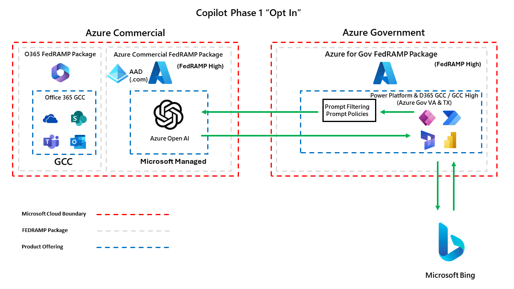
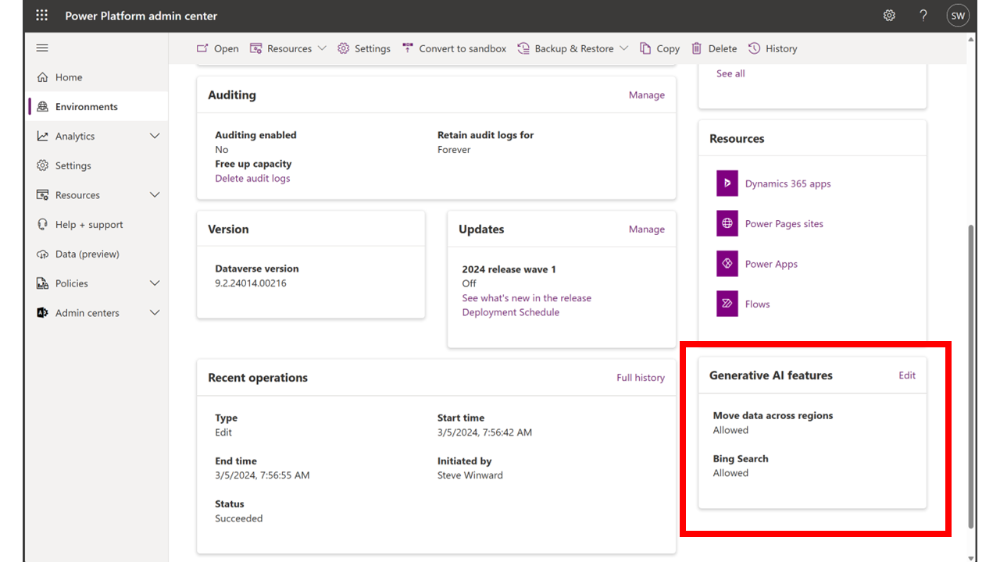
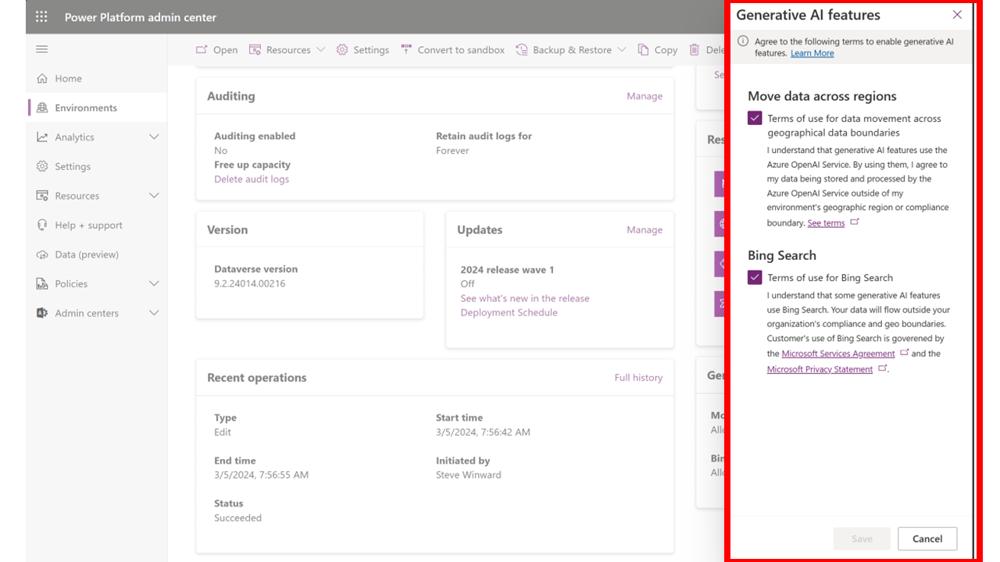
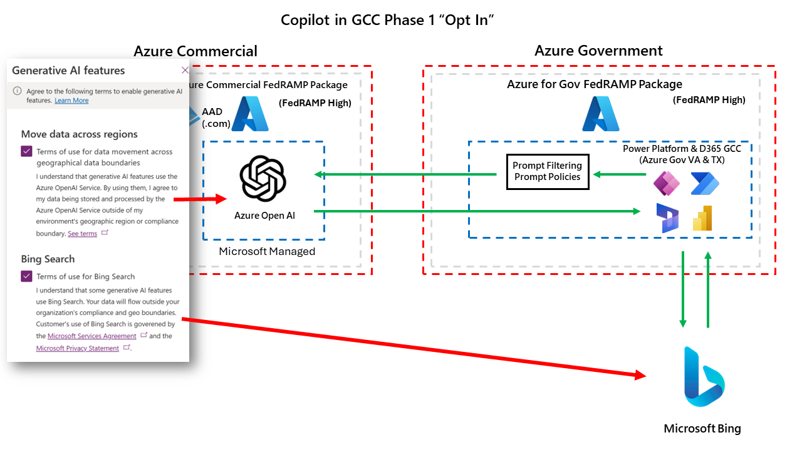

# Federal Copilot Resources for Microsoft Business Applications
The goal of this whitepaper is to serve as a guide for all US Federal customers to understand how Copilot across US Federal sovereign clouds is rolling out for Power Platform and Dynamics 365.  We also want to outline our Microsoft Responsible AI framework, demonstrate what security protections we put in place for end users and organizational data, as well as illustrate architecture diagrams of how all of this works.  

This document will continue to evolve as we roll out more features and functionality overtime.

## Responsible AI
Every Microsoft Business Applications service has their own dedicated Responsible AI page on our public documentation site.  Below we have summarized the links for all Power Platform and D365 services and their associated Responsible AI page.

* [Power Platform](https://learn.microsoft.com/en-us/power-platform/responsible-ai-overview)
  * [Power Apps](https://learn.microsoft.com/en-us/power-apps/maker/common/responsible-ai-overview/)
  * [Power Automate](https://learn.microsoft.com/en-us/power-automate/responsible-ai-overview/)
  * [Power Pages](https://learn.microsoft.com/en-us/power-pages/responsible-ai-overview/)
  * [AI Builder](https://learn.microsoft.com/en-us/ai-builder/responsible-ai-overview)
  * [Copilot Studio](https://learn.microsoft.com/en-us/microsoft-copilot-studio/responsible-ai-overview)
* Dynamics 365
  * [D365 Customer Service](https://learn.microsoft.com/en-us/dynamics365/customer-service/implement/responsible-ai-overview)
 
## Azure OpenAI
Azure OpenAI is the service that all Copilot features are built upon. 

> The Azure OpenAI Service is fully controlled by Microsoft; Microsoft hosts the OpenAI models in Microsoft’s Azure environment and the Service does NOT interact with any services operated by OpenAI (e.g. ChatGPT, or the OpenAI API).

For a full description of Azure OpenAI's data, privacy and security details, you can find them in the link below,

* [Data, privacy, and security for Azure OpenAI Service](https://learn.microsoft.com/en-us/legal/cognitive-services/openai/data-privacy)

## Copilot Data and Security for Power Platform and D365
We have a detailed writeup and FAQ on our public docs in the link below,

* [FAQ for Copilot in Power Platform and D365](https://learn.microsoft.com/en-us/power-platform/faqs-copilot-data-security-privacy)

### Prompt Injection / Jailbreak Attack
All Power Platform and D365 services are required to protect against prompt injections (ie jailbreak attacks).  We outline the common injection attacks and how we mitigate for those in our Azure OpenAI service in the documentation page below,

* [Azure OpenAI Jailbreak Risk Detection](https://learn.microsoft.com/en-us/azure/ai-services/content-safety/concepts/jailbreak-detection)

### Testing Copilot for Quality and Security
Every new Copilot product and language model iteration must pass an internal responsible AI review before it can be launched. Before release, we use a process called "red teaming" (in which a team simulates an enemy attack, finding and exploiting weaknesses to help the organization improve its defenses) to assess potential risks in harmful content, jailbreak scenarios, and grounded responses. After release, we use automated testing and manual and automated evaluation tools to assess the quality of Copilot responses.

## Phase 1: Opt In with Azure Commercial
Phase 1 will leverage Azure Commercial Azure OpenAI to enable Copilot capabilities.  The diagram below outlines how this will work.

During Phase 1, admins will be able to "opt in" to this at the environment level to turn these capabilities on.  Below shows when you can find these settings at the environment level,

The consent options you will have are below.  Both of the consent options are optional.  You do not need to require one to enable the other.

Mapping the consent options from the Power Platform Admin Center you can see which checkbox enables which integration features.

## Phase 1: Timeline
Below outlines when you can expect to see Power Platform / D365 Copilot capabilities with the Phase 1 rollout,

* Spring 2024 (GCC & GCC High)
  * AI Builder
    * [Create text using custom prompt](https://learn.microsoft.com/en-us/ai-builder/create-a-custom-prompt)
  * Copilot Studio
    * [Generative AI in Copilot Studio](https://learn.microsoft.com/en-us/microsoft-copilot-studio/nlu-gpt-overview)
  * Power Apps Copilot
    * [Build apps through conversation](https://learn.microsoft.com/en-us/power-apps/maker/canvas-apps/ai-conversations-create-app)
    * [Describe the new table](https://learn.microsoft.com/en-us/power-apps/user/well-written-input-text-copilot)
    * [Draft with Copilot](https://learn.microsoft.com/en-us/power-apps/user/well-written-input-text-copilot)
* Summer 2024 (GCC & GCC High)
  * D365 Customer Service
    * [Managed D365 Customer Service Copilot Features](https://learn.microsoft.com/en-us/dynamics365/customer-service/administer/configure-copilot-features)
  * Power Pages
    * [Overview of Power Pages Copilot Features](https://learn.microsoft.com/en-us/power-pages/configure/ai-copilot-overview)
  * Power Automate
    * [Power Automate Clow Flows with Copilot](https://learn.microsoft.com/en-us/power-automate/get-started-with-copilot)
