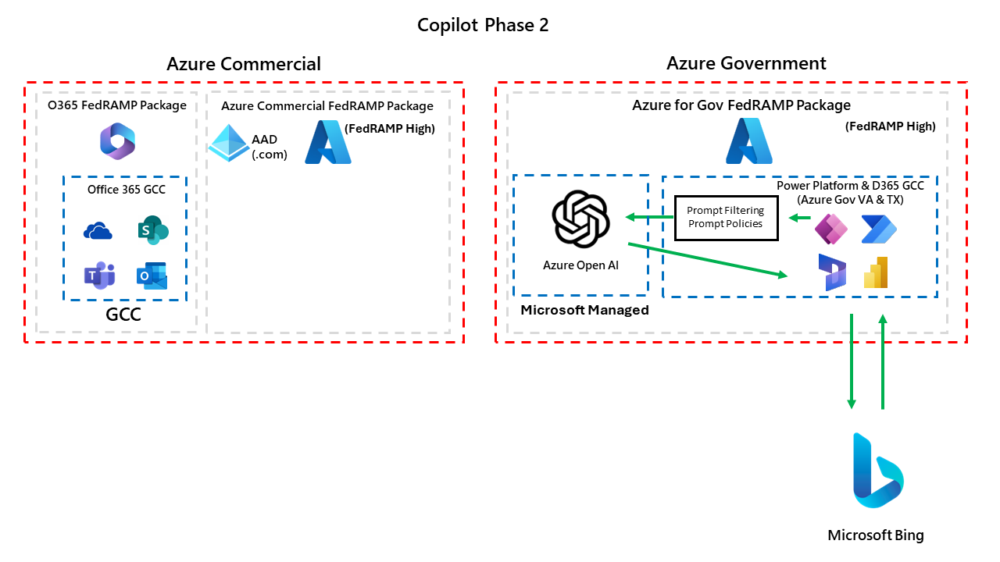

# Federal Copilot Resources for Microsoft Business Applications
The goal of this whitepaper is to serve as a guide for all US Federal customers to understand how Copilot across US Federal sovereign clouds is rolling out for Power Platform and Dynamics 365.  We also want to outline our Microsoft Responsible AI framework, demonstrate what security protections we put in place for end users and organizational data, as well as illustrate architecture diagrams of how all of this works.  

This document will continue to evolve as we roll out more features and functionality overtime.

## Responsible AI
Every Microsoft Business Applications service has their own dedicated Responsible AI page on our public documentation site.  Below we have summarized the links for all Power Platform and D365 services and their associated Responsible AI page.

* [Power Platform](https://learn.microsoft.com/en-us/power-platform/responsible-ai-overview)
  * [AI Builder](https://learn.microsoft.com/en-us/ai-builder/responsible-ai-overview)
  * [Copilot Studio](https://learn.microsoft.com/en-us/microsoft-copilot-studio/responsible-ai-overview)
  * [Power Apps](https://learn.microsoft.com/en-us/power-apps/maker/common/responsible-ai-overview/)
  * [Power Automate](https://learn.microsoft.com/en-us/power-automate/responsible-ai-overview/)
  * [Power Pages](https://learn.microsoft.com/en-us/power-pages/responsible-ai-overview/)
* [Dynamics 365](https://learn.microsoft.com/en-us/dynamics365/responsible-ai-overview)
  * [D365 Customer Service](https://learn.microsoft.com/en-us/dynamics365/customer-service/implement/responsible-ai-overview)
 
## Azure OpenAI
Azure OpenAI is the service that all Copilot features are built upon. 

> [!IMPORTANT] 
> Your prompts (inputs) and completions (outputs), your embeddings, and your training data:
> 
> * are NOT available to other customers.
> * are NOT available to OpenAI.
> * are NOT used to improve OpenAI models.
> * are NOT used to improve any Microsoft or 3rd party products or services.
> * are NOT used for automatically improving Azure OpenAI models for your use in your resource (The models are stateless, unless you explicitly fine-tune models with your training data).
> 
> Your fine-tuned Azure OpenAI models are available exclusively for your use.
The Azure OpenAI Service is fully controlled by Microsoft; Microsoft hosts the OpenAI models in Microsoft’s Azure environment and the Service does NOT interact with any services operated by OpenAI (e.g. ChatGPT, or the OpenAI API).

For a full description of Azure OpenAI's data, privacy and security details, you can find them in the link below,

* [Data, privacy, and security for Azure OpenAI Service](https://learn.microsoft.com/en-us/legal/cognitive-services/openai/data-privacy)

## Bing Integration
Some features in Power Platform and D365 can also leverage the Bing index to combine public website search results into Copilot features.  Integrating with Bing is completely optional, is turned off by default and is not required to take advantage of Copilot capabilities.

> [!NOTE]
> Bing is not included in the scope of the FedRAMP package for Azure Commercial or Azure for Government.  This is why this setting is turned off by default.

Examples of Bing integration with Copilot capabilities are listed below,

* Copilot Studio
   * [Search public data or use a Bing Custom Search for generative answers](https://learn.microsoft.com/en-us/microsoft-copilot-studio/nlu-generative-answers-bing)
 * D365 Customer Service
   * [Write an Email: add trusted webpages as sources](https://learn.microsoft.com/en-us/dynamics365/customer-service/administer/copilot-enable-help-pane#add-trusted-webpages-as-sources)

## Copilot Data and Security for Power Platform and D365
We have a detailed writeup and FAQ of some of our most common questions customers ask around security and data privacy for Copilot features across Power Platform and D365.  The link can be found below,

* [FAQ for Copilot in Power Platform and D365](https://learn.microsoft.com/en-us/power-platform/faqs-copilot-data-security-privacy)

### Prompt Injection / Jailbreak Attack Protections
All Power Platform and D365 services are required to protect against prompt injections (i.e. jailbreak attacks).  We outline the common injection attacks and how we mitigate for those in our Azure OpenAI service in the documentation page below,

* [Azure OpenAI Jailbreak Risk Detection](https://learn.microsoft.com/en-us/azure/ai-services/content-safety/concepts/jailbreak-detection)

### Testing Copilot for Quality and Security
Every new Copilot product and language model iteration must pass an internal responsible AI review before it can be launched. Before release, we use a process called "red teaming" (in which a team simulates an enemy attack, finding and exploiting weaknesses to help the organization improve its defenses) to assess potential risks in harmful content, jailbreak scenarios, and grounded responses. After release, we use automated testing and manual and automated evaluation tools to assess the quality of Copilot responses.

### DLP Policies
Copilot features in Power Platform and Dynamics 365 do not have elevated security permissions to view data that otherwise could not be viewed.  This means that access control assigned to data in Dataverse still is obeyed by Copilot features.

Existing security controls like [Data Loss Prevention Policies](https://learn.microsoft.com/en-us/power-platform/admin/wp-data-loss-prevention) still apply to Copilot features including Copilot Studio,

* [Block Power Platform Connectors from Microsoft Copilot Studio copilots](https://learn.microsoft.com/en-us/microsoft-copilot-studio/dlp-example-4?tabs=webapp)

## Phase 1: Opt In with Azure Commercial Azure OpenAI
Phase 1 will leverage Azure Commercial Azure OpenAI to enable Copilot capabilities.  The diagram below outlines how this will work.

> [!NOTE]
> During Phase 1, tenant level admins (i.e. Power Platform Administrator, Global Administrator) will be able to "opt in" to this at the environment level to turn these capabilities on. Environment Admins can see the setting, however if they try to change it they will receive an error message.

Below shows when you can find these settings at the environment level,

The consent options you will have are below.  Both of the consent options are optional.  You do not need to require one to enable the other.

Mapping the consent options from the Power Platform Admin Center you can see which checkbox enables which integration features.

## Phase 1: Timeline
Below outlines when you can expect to see Power Platform / D365 Copilot capabilities with the Phase 1 rollout,

* Available Today (GCC & GCC High)
   * AI Builder
     * [Create text using custom prompt](https://learn.microsoft.com/en-us/ai-builder/create-a-custom-prompt)
* Spring 2024 (GCC & GCC High)
  * Copilot Studio
    * [Generative AI in Copilot Studio](https://learn.microsoft.com/en-us/microsoft-copilot-studio/nlu-gpt-overview)
  * Power Apps Copilot
    * [Build apps through conversation](https://learn.microsoft.com/en-us/power-apps/maker/canvas-apps/ai-conversations-create-app)
    * [Describe the new table](https://learn.microsoft.com/en-us/power-apps/user/well-written-input-text-copilot)
    * [Draft with Copilot](https://learn.microsoft.com/en-us/power-apps/user/well-written-input-text-copilot)
* Summer 2024 (GCC & GCC High)
  * D365 Customer Service
    * [Managed D365 Customer Service Copilot Features](https://learn.microsoft.com/en-us/dynamics365/customer-service/administer/configure-copilot-features)
  * Power Pages
    * [Overview of Power Pages Copilot Features](https://learn.microsoft.com/en-us/power-pages/configure/ai-copilot-overview)
  * Power Automate
    * [Power Automate Cloud Flows with Copilot](https://learn.microsoft.com/en-us/power-automate/get-started-with-copilot)

## Phase 2: Azure for Government Azure OpenAI
Phase 2 will leverage Azure for Government Azure OpenAI to enable Copilot capabilities.  The diagram below outlines how this will work.  The product group is still working on timelines and roadmaps for this.

