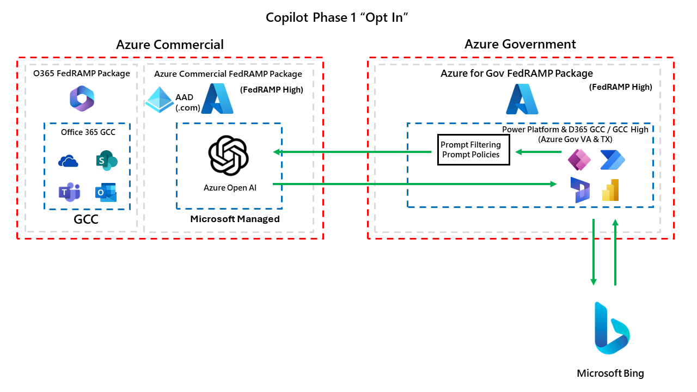

# Federal Copilot Resources for Microsoft Business Applications
The goal of this whitepaper is to serve as a guide for all US Federal customers to understand how Copilot across US Federal sovereign clouds is rolling out for Power Platform and Dynamics 365.  We also want to outline our Microsoft Responsible AI framework, demonstrate what security protections we put in place for end users and organizational data, as well as illustrate architecture diagrams of how all of this works.  

This document will continue to evolve as we roll out more features and functionality overtime.

## Responsible AI
We have a wealth of documentation on our public documentation site for how we ensure Microsoft's Responsible AI framework is followed for all Microsoft Business Applications products

* [Power Platform](https://learn.microsoft.com/en-us/power-platform/responsible-ai-overview)
  * [Power Apps](https://learn.microsoft.com/en-us/power-apps/maker/common/responsible-ai-overview/)
  * [Power Automate](https://learn.microsoft.com/en-us/power-automate/responsible-ai-overview/)
  * [Power Pages](https://learn.microsoft.com/en-us/power-pages/responsible-ai-overview/)
  * [AI Builder](https://learn.microsoft.com/en-us/ai-builder/responsible-ai-overview)
  * [Copilot Studio](https://learn.microsoft.com/en-us/microsoft-copilot-studio/responsible-ai-overview)
* Dynamics 365
  * [D365 Customer Service](https://learn.microsoft.com/en-us/dynamics365/customer-service/implement/responsible-ai-overview)

## Phase 1: Opt In with Azure Commercial
Phase 1 will leverage Azure Commercial Azure OpenAI to enable Copilot capabilities.  The diagram below outlines how this will work.

During Phase 1, admins will be able to "opt in" to this at the environment level to turn these capabilities on.  Below shows when you can find these settings at the environment level,

The consent options you will have are below.  Both of the consent options are optional.  You do not need to require one to enable the other.

Mapping the consent options from the Power Platform Admin Center you can see which checkbox enables which integration features.

## Phase 1: Timeline
Below outlines when you can expect to see Power Platform / D365 Copilot capabilities with the Phase 1 rollout,

* Spring 2024 (GCC & GCC High)
  * AI Builder
    * [Create text using custom prompt](https://learn.microsoft.com/en-us/ai-builder/create-a-custom-prompt)
  * Copilot Studio
    * [Generative AI in Copilot Studio](https://learn.microsoft.com/en-us/microsoft-copilot-studio/nlu-gpt-overview)
  * Power Apps Copilot
* Summer 2024 (GCC & GCC High)
  * D365 Customer Service
  * Power Pages
  * Power Automate
