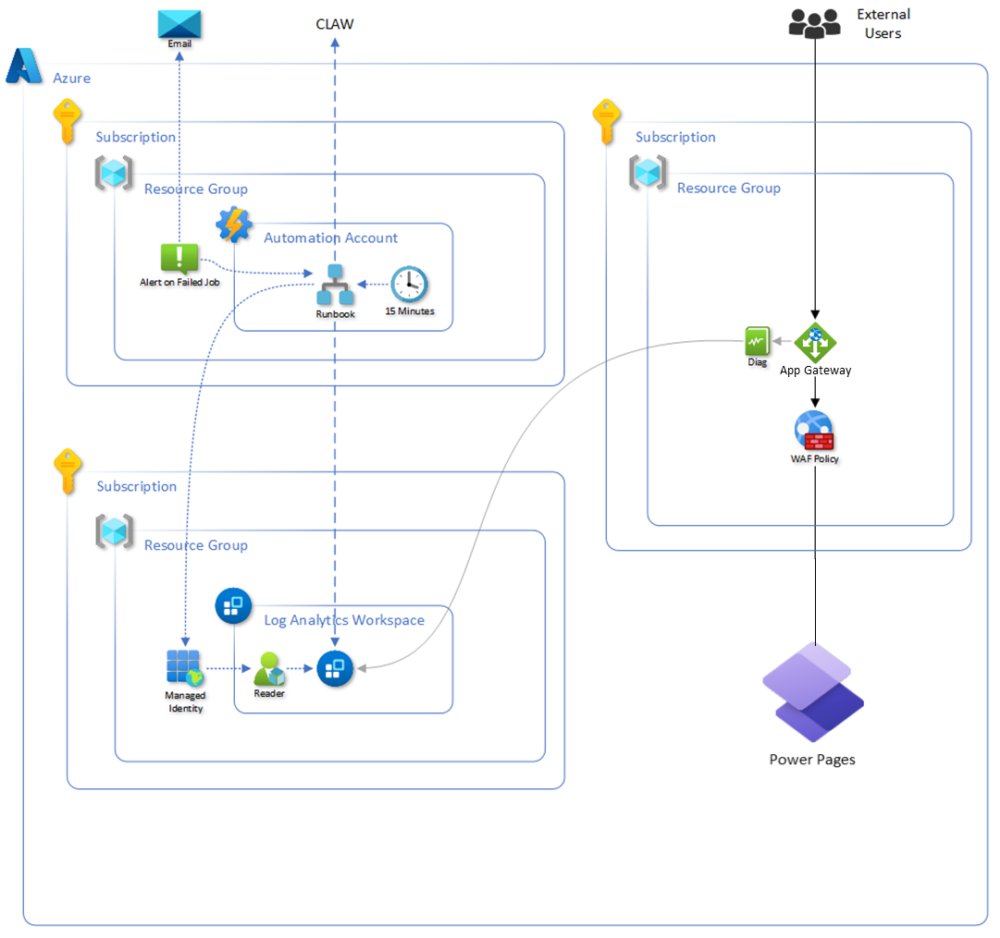

# Federal Security Resources for Microsoft Business Applications
The goal of this whitepaper is to have a single place to refer for US Federal security and accreditation resources for Power Platform and GCC.

# FedRAMP Packages
* [Azure Commercial FedRAMP Package](https://marketplace.fedramp.gov/products/F1209051525)
  * Includes only commercial Power Platform and Dynamics 365 services
* [Azure for Government FedRAMP Package](https://marketplace.fedramp.gov/products/F1603087869)
  * Includes both GCC and GCC High environments for Power Platform and Dynamics 365 services
* [Office 365 Multi-Tenant & Supporting Services](https://marketplace.fedramp.gov/products/MSO365MT)
  * Office 365 GCC
* [Microsoft Office 365 GCC High](https://marketplace.fedramp.gov/products/FR1824057433)
  * Office 365 GCC High
  
If you need to request any of the actual FedRAMP packages from Microsoft, please send a request to azurefedramp@microsoft.com.
  
A visual diagram of our FedRAMP packages above for a GCC customer is shown below,
 


### How does data travel from Office365 GCC to Power Platform GCC?  
Microsoft maintains a **private**, global network infrastructure that seamlessly interconnects all of our data centers. This dedicated network ensures that **communications between Azure Government and Azure Commercial services occur over Microsoft's secure, high-speed fiber network, rather than the public internet**. Our intelligent networking stack ensures that data travels efficiently within our ecosystem, providing reliable and secure connectivity for all services.

# CISA Recommended Security Baseline
CISA's Secure Cloud Business Applications (SCuBA) official website can be found below,

* [CISA SCuBA Official Page](https://www.cisa.gov/scuba)

CISA has published M365 Minimum Viable Secure Configuration Baseline documents for various Microsoft products.  Below is a link to the entire GitHub repository,

* [SCuBA M365 Security Baseline Assessment Tool on GitHub](https://github.com/cisagov/ScubaGear)

The security baseline recommendations Power Platform and Power BI can be found below,

* [Microsoft Power Platform M365 Minimum Viable Secure Configuration Baseline](https://github.com/cisagov/ScubaGear/blob/main/PowerShell/ScubaGear/baselines/powerplatform.md)
* [Microsoft Power BI M365 Minimum Viable Secure Configuration Baseline](https://github.com/cisagov/ScubaGear/blob/main/PowerShell/ScubaGear/baselines/powerbi.md)

# Passkey (FIDO2) Support for End Users

Microsoft Entra supports FIDO2 authentication.  Because Power Platform and Dynamics 365 are secured with Microsoft Entra it is very easy to configure and set this up for your organization.  You can read more details on how to configure this below,

* [Enable passkeys (FIDO2) for your organization](https://learn.microsoft.com/en-us/entra/identity/authentication/how-to-enable-passkey-fido2)

# Passkey (FIDO2) Support for Power Platform CLI Tool

The Power Platform CLI allows you to authenticate with FIDO2 / Passkeys.  To do this today, you need to leverage the .NET Core version of the Power Platform CLI tool.  Instructions to install the .NET Core version can be found in the documentation page below,

* [.NET Core Power Platform CLI Install Steps](https://learn.microsoft.com/en-us/power-platform/developer/howto/install-cli-net-tool?tabs=windows)

Below is an example to authenticate with the .NET Core Power Platform CLI,

```
pac.exe auth create --cloud UsGov
```

# Passkey (FIDO2) Support for Power Apps PowerShell Module

As of version 2.0.212, you can now use FIDO2 / Passkey authentication with the Power Apps PowerShell Module.  You can get the latest version in the PowerShell Gallery site below,

* [Microsoft.PowerApps.Administration.PowerShell Module](https://www.powershellgallery.com/packages/Microsoft.PowerApps.Administration.PowerShell/2.0.212)

When you use this module, you need to specify you want to use the System Browser for authentication.  This allows you to use Microsoft Edge as the browser to do your authentication which supports FIDO2 authentication.  Below is an example of authenticating to a GCC endpoint and specifying to use the System Browser (i.e. Edge).

```powershell
Add-PowerAppsAccount -Endpoint "usgov" -UseSystemBrowser: $true
```

> [!NOTE]
> If you need to use the ````Get-TenantDetailsFromGraph```` command this does not support FIDO2 as of version 2.0.212.  Instead, we recommend using the Microsoft Graph PowerShell Module.  You can download the latest Microsoft Graph PowerShell Module which can be found [here](https://www.powershellgallery.com/packages/Microsoft.Graph/2.28.0)

Below is a sample of using the Microsoft Graph PowerShell Module to get the organization information that ````Get-TenantDetailsFromGraph```` will also give you.  However, this PowerShell Module supports FIDO2 authentication today.

```powershell
# First Authenticate to the Microsoft Graph API
Connect-MgGraph -Scopes "Directory.Read.All"

# Now Get the Tenant Organization Details
Get-MgOrganization | Format-List
```

# TIC 3.0 for Internal Agency Use

For internal Agency use of Power Platform and Dynamics 365, our services leverage the security and auditing capabilities of Microsoft 365.  We have a great blog series that outlines how Microsoft 365 services align to TIC.  The blog links can be found below,

* [Part 1 - Securing Mobile](https://devblogs.microsoft.com/azuregov/securing-mobile-designing-saas-service-implementations-to-meet-federal-tic-policy-1-of-4/)
* [Part 2 - Securing the Endpoint](https://devblogs.microsoft.com/azuregov/securing-the-endpoint-designing-saas-service-implementations-to-meet-federal-policy-2-of-4/)
* [Part 3 - Securing the Platform](https://techcommunity.microsoft.com/t5/public-sector-blog/securing-the-platform-designing-saas-service-implementations-to/ba-p/1192088)
* [Part 4 - Auditing and Logging](https://techcommunity.microsoft.com/t5/public-sector-blog/auditing-and-logging-designing-saas-service-implementations-to/ba-p/1550810)

## Power Platform / Dynamics 365 Auditing

You can view all of the audit logs specific to Power Platform and Dynamics 365 the same way you would for all other O365 services as described in the blog articles above.  Details on each Power Platform / Dynamics 365 service and their corresponding auditing types that get logged can be found in our documentation pages below,

* [Power Apps Audit Logs](https://learn.microsoft.com/en-us/power-platform/admin/logging-powerapps)
* [Power Automate Audit Logs](https://learn.microsoft.com/en-us/power-platform/admin/logging-power-automate)
* [Data loss prevention (DLP) Audit Logs](https://learn.microsoft.com/en-us/power-platform/admin/dlp-activity-logging)
* [Power Platform Connection Audit Logs](https://learn.microsoft.com/en-us/power-platform/admin/connector-events-power-platform)
* [Dataverse and model-driven apps Audit Logs](https://learn.microsoft.com/en-us/power-platform/admin/enable-use-comprehensive-auditing)

Full details of auditing capabilities inside of Dataverse can be found in the link below,

* [Manage Dataverse Auditing](https://learn.microsoft.com/en-us/power-platform/admin/enable-use-comprehensive-auditing)

## Azure Active Directory Conditional Access
The sovereign cloud specific AAD applications for conditional access are below,

### GCC AAD Application Details
| Service | AAD Application Name | AAD Application ID |
| ------- | -------------------- | ------------------ |
| Power Apps | ```` Microsoft PowerApps ```` | ```` 475226c6-020e-4fb2-8a90-7a972cbfc1d4 ```` |
| Power Automate | ```` Microsoft Flow ```` | ```` 7df0a125-d3be-4c96-aa54-591f83ff541c ```` |
| Dataverse / Dynamics 365 | ```` Common Data Service ```` | ```` 00000007-0000-0000-c000-000000000000 ```` |
| Power BI | ```` Microsoft Power BI Government Cloud ```` | ```` fc4979e5-0aa5-429f-b13a-5d1365be5566 ```` |

### GCC High AAD Application Details
| Service | AAD Application Name | AAD Application ID |
| ------- | -------------------- | ------------------ |
| Power Apps | ```` PowerApps Service GCC L4 ```` | ```` 5e0cb1f6-2841-4956-9c76-868bfbc15a39 ```` |
| Power Automate | ```` Microsoft Flow Portal GCC High ```` | ```` 9856e8dd-37b6-4749-a54b-8f6503ea93b7 ```` |
| Dataverse / Dynamics 365 | ```` Common Data Service ```` | ```` 00000007-0000-0000-c000-000000000000 ```` |


> At this time (10/28/2022) there is a known issue that the Power Automate service does not show up in Azure for Government's Conditional Access portal.  The work around to use conditional access in GCC High is to create a policy that is enforced for all cloud applications, versus selecting Power Automate individually.  

# TIC 3.0 for Public Facing Power Pages (i.e. Portals)

We recommend using Azure Application Gateway with Power Pages to support CISA TIC requirements.  Some of the benefits you get when using Azure Application Gateway with Power Pages are below,

* Built in Web Application Firewall (WAF)
* Content Delivery Network (CDN) of static content in Power Pages
* Restrict Power Pages traffic to a single IP address from Azure Application Gateway

> [!NOTE]  
> When your compliance requirements allow for platform-managed security controls, the native "turnkey" CDN and WAF features are now available in GCC for Power Pages as of May 15, 2025. Lean more: [Announcing Content Delivery Network and Web Application Firewall for US Government Cloud in Power Pages - Microsoft Power Platform Blog](https://www.microsoft.com/en-us/power-platform/blog/power-pages/announcing-content-delivery-network-and-web-application-firewall-for-us-government-cloud-in-power-pages)

Below are great resource on designing a general web application to use Azure Front Door / Azure Application Gateway to meet TIC 3.0 requirements,

* [TIC 3.0 Azure Web Application Architecture](https://github.com/microsoft/Federal-App-Innovation-Community/tree/main/assets/topics/infrastructure/solutions/tic3.0/Azure-Application-Gateway)
* [Implement TIC 3.0 compliance (MS Learn)](https://learn.microsoft.com/en-us/azure/architecture/networking/architecture/trusted-internet-connections)

You can easily swap out the web application above with a Power Pages web application.  That design would look like this,



Below we have great documentation on how to configure a Power Pages Portal with Azure Front Door.  While today we recommend Azure Application Gateway, the documentation for Azure Front Door below can also be applied with an Azure Application Gateway instance.  

> Today Power Pages does not support Azure Front Door ID filtering. Once Power Pages supports Azure Front Door ID filtering (i.e. ````X-Azure-FDID```` header values) we will update this guidance to use Azure Front Door instead.

* [Set up Azure Front Door with portals](https://learn.microsoft.com/en-us/power-apps/maker/portals/azure-front-door)

# Power Pages Diagnostic Logging

You can also configure diagnostic logs from Power Pages to get sent to an Azure Storage account.


# Power Pages (i.e. Portals) Security Settings
When designing a Power Page, we highly recommend reviewing the security controls for any public facing website.  Those details can be found in our public documentation below,

* [Power Pages Security Controls](https://learn.microsoft.com/en-us/power-pages/security/power-pages-security)

# Power Platform / Dynamics 365 Endpoint URLs
Use the following public documentation page to get the full list of internet URLs to allow for Power Platform and Dynamics 365 cloud services.  Make sure to filter to your US Government cloud region (i.e. GCC, GCC High or DOD).

* [Power Platform Government Endpoint URLs for Allow List](https://learn.microsoft.com/en-us/power-platform/admin/online-requirements#internet-urls-to-allow)
* [Dynamics 365 Government Endpoint URLs for Allow List](https://learn.microsoft.com/en-us/power-platform/admin/microsoft-dynamics-365-government#dynamics-365-us-government-urls)

# Power Platform / Dynamics 365 IP Ranges
Use the following Azure for Government service tags to get the IP ranges that Power Platform / Dynamics 365 use for GCC, GCC High and DOD cloud regions.  You can find the full list of Azure for Government IP Ranges in the following document,

* [Azure for Government IP Ranges](https://www.microsoft.com/en-us/download/details.aspx?id=57063)

## GCC and GCC High IP Ranges
* ````AzureCloud.usgovvirginia````
* ````AzureCloud.usgovtexas````

## DOD IP Ranges
* ````AzureCloud.usdodcentral````
* ````AzureCloud.usdodeast````

# Microsoft 365 Message Center
We also recommend that you set up monitoring for the Microsoft 365 Message Center to get notified to updates and changes that we announce ahead of time that could impact network and firewall policies you have configured.  Details of the Microsoft 365 Message Center can be found on the public documentation page below,

[Microsoft 365 Message Center Documentation](https://learn.microsoft.com/en-us/microsoft-365/admin/manage/message-center?view=o365-worldwide)

For Microsoft Business Applications, we recommend monitoring the following services,

* Dynamics 365 Apps
* Finance and Operations Apps
* Microsoft Dataverse
* Microsoft Power Automate
* Microsoft Power Automate in Microsoft 365
* Power Apps
* Power Apps in Microsoft 365
* Power BI
* Power Platform

# Data Gateway Configuration
Power Platform's data gateway enables you to combine on premise data with your data in the cloud.  More details on the data gateway can be found in our public docs below,

* [On-premises data gateways documentation](https://learn.microsoft.com/en-us/data-integration/gateway/)

Power Platform data gateway leverages the Azure Service Bus Relay service to communicate from the cloud to your on premise infrastructure.  In GCC, GCC High and DOD there is a managed Azure Service Bus Relay namespace that lives in Azure for Government.  Below is an example of how this is laid out in GCC,


If you want to have more control of the networking policies for the Azure Service Bus Relay instance, you can create your own in an Azure for Government subscription.


You can then configure your Power Platform data gateway instance to leverage your Azure Service Bus Relay instance in the steps below,

* [Configure a Custom Azure Service Bus Relay](https://learn.microsoft.com/en-us/data-integration/gateway/service-gateway-azure-relay)

Also, if you are using Azure for Government ExpressRoute and you want the Power Platform data gateway to use ExpressRoute, you need to make sure you include the following Azure service tags into your ExpressRoute configuration,

## Data Gateway Ports
For a full list of the Data Gateway ports and fully qualified domain names (FQDN) that are required to run Data Gateway, please see our public documentation page below.  Be sure to reference the table for GCC, GCC High or DOD for your actual environments configuration details.

* [Power Platform Data Gateway Ports & FQDN Documentation](https://learn.microsoft.com/en-us/data-integration/gateway/service-gateway-communication#ports)

## GCC and GCC High Service Tags

* ````ServiceBus.USGovTexas````
* ````ServiceBus.USGovVirginia````

## DOD Service Tags

* ````ServiceBus.USDoDCentral````
* ````ServiceBus.USDoDEast````

You can find the full list of Azure for Government IP Ranges in the following document,

* [Azure for Government IP Ranges](https://www.microsoft.com/en-us/download/details.aspx?id=57063)
