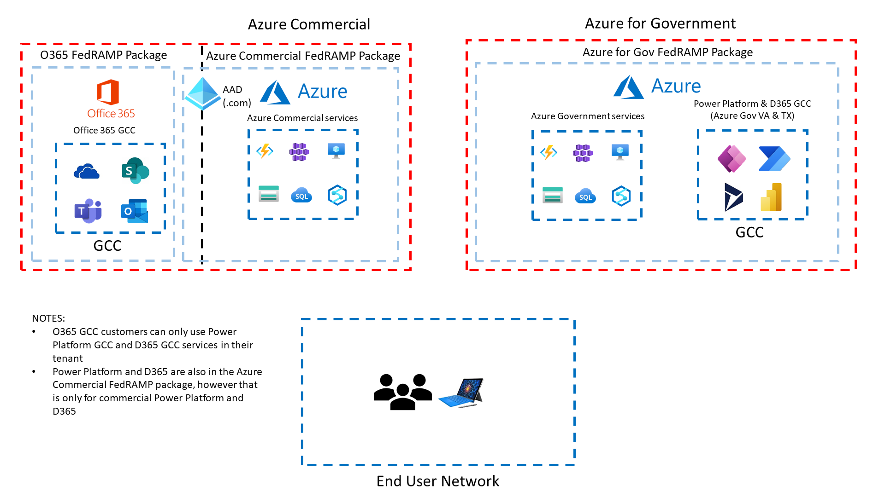
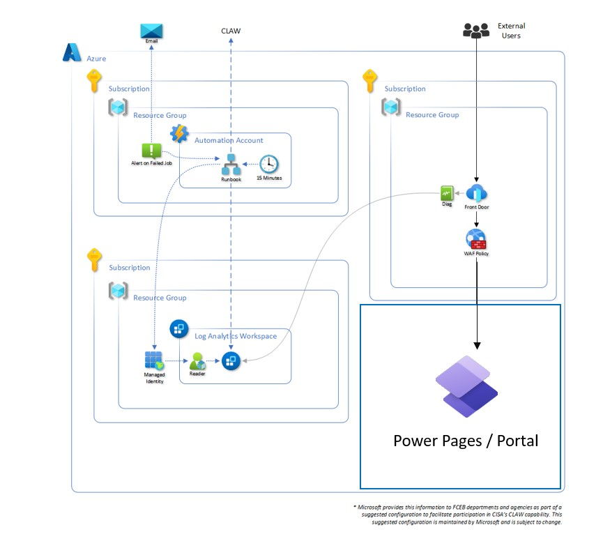
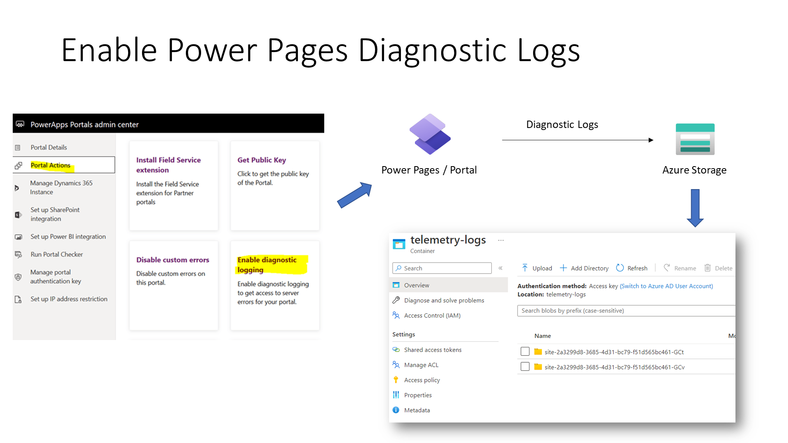
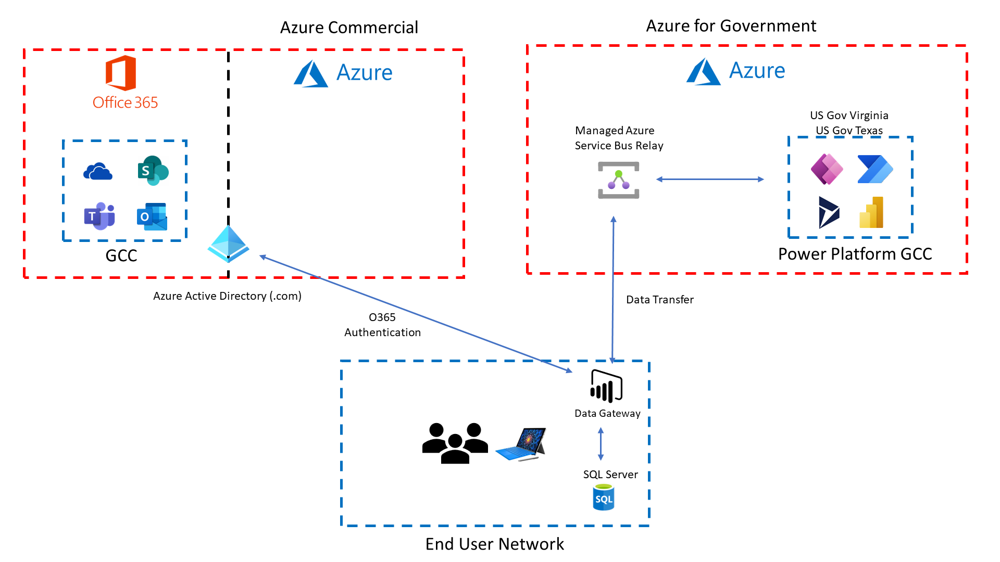
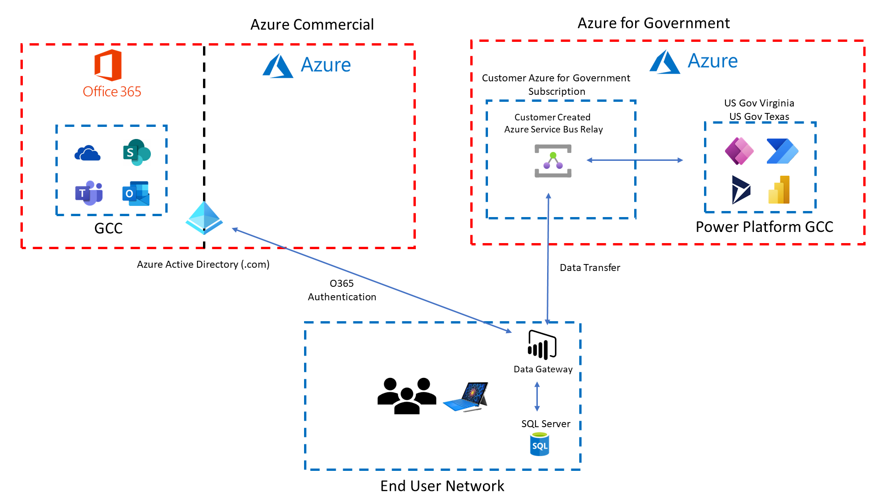

# Federal Security Resources for Microsoft Business Applications
The goal of this whitepaper is to have a single place to refer for US Federal security and accreditation resources for Power Platform and GCC.

# FedRAMP Packages
* [Azure Commercial FedRAMP Package](https://marketplace.fedramp.gov/#!/product/azure-commercial-cloud?sort=productName)
  * Includes only commercial Power Platform and D365 services
* [Azure for Government FedRAMP Package](https://marketplace.fedramp.gov/#!/product/azure-government-includes-dynamics-365?sort=productName)
  * Includes both GCC and GCC High environments for Power Platform and D365 services
* [Office 365 Multi-Tenant & Supporting Services](https://marketplace.fedramp.gov/#!/product/office-365-multi-tenant--supporting-services?sort=productName)
  * Office 365 GCC
* [Microsoft Office 365 GCC High](https://marketplace.fedramp.gov/#!/product/microsoft-office-365-gcc-high?sort=productName)
  * Office 365 GCC High
  
If you need to request any of the actual FedRAMP packages from Microsoft, please send a request to azurefedramp@microsoft.com.
  
A visual diagram of our FedRAMP packages above for a GCC customer is shown below,
 


# CISA Recommended Security Baseline
CISA's Secure Cloud Business Applications (SCuBA) official website can be found below,

[CISA SCuBA Official Page](https://www.cisa.gov/scuba)

CISA has published M365 Minimum Viable Secure Configuration Baseline documents for various Microsoft products.  Below is a link to the entire GitHub repository,

[SCuBA M365 Security Baseline Assessment Tool](https://github.com/cisagov/ScubaGear)

The security baseline recommendations Power Platform and Power BI can be found below,

* [Microsoft Power Platform M365 Minimum Viable Secure Configuration Baseline](https://github.com/cisagov/ScubaGear/blob/main/baselines/powerplatform.md)
* [Microsoft Power BI M365 Minimum Viable Secure Configuration Baseline](https://github.com/cisagov/ScubaGear/blob/main/baselines/powerbi.md)

# TIC for Internal Agency Use

For internal Agency use of Power Platform and D365, our services leverage the security and auditing capabilities of Microsoft 365.  We have a great blog series that outlines how Microsoft 365 services align to TIC.  The blog links can be found below,

* [Part 1 - Securing Mobile](https://devblogs.microsoft.com/azuregov/securing-mobile-designing-saas-service-implementations-to-meet-federal-tic-policy-1-of-4/)
* [Part 2 - Securing the Endpoint](https://devblogs.microsoft.com/azuregov/securing-the-endpoint-designing-saas-service-implementations-to-meet-federal-policy-2-of-4/)
* [Part 3 - Securing the Platform](https://techcommunity.microsoft.com/t5/public-sector-blog/securing-the-platform-designing-saas-service-implementations-to/ba-p/1192088)
* [Part 4 - Auditing and Logging](https://techcommunity.microsoft.com/t5/public-sector-blog/auditing-and-logging-designing-saas-service-implementations-to/ba-p/1550810)

## Power Platform / D365 Auditing

You can view all of the audit logs specific to Power Platform and D365 the same way you would for all other O365 services as described in the blog articles above.  Details on each Power Platform / D365 service and their corresponding auditing types that get logged can be found in our documentation pages below,

* [Power Apps Audit Logs](https://learn.microsoft.com/en-us/power-platform/admin/logging-powerapps)
* [Power Automate Audit Logs](https://learn.microsoft.com/en-us/power-platform/admin/logging-power-automate)
* [Data loss prevention (DLP) Audit Logs](https://learn.microsoft.com/en-us/power-platform/admin/dlp-activity-logging)
* [Power Platform Connection Audit Logs](https://learn.microsoft.com/en-us/power-platform/admin/connector-events-power-platform)
* [Dataverse and model-driven apps Audit Logs](https://learn.microsoft.com/en-us/power-platform/admin/enable-use-comprehensive-auditing)

Full details of auditing capabilities inside of Dataverse can be found in the link below,

* [Manage Dataverse Auditing](https://learn.microsoft.com/en-us/power-platform/admin/enable-use-comprehensive-auditing)

> For GCC only, you will need to use the classic Dynamics 365 settings page to enable audit logs getting sent to the O365 Security and Compliance Center.  From the Power Apps home page, click on Settings (gear icon) > Advanced settings > Settings > Auditing > Global Audit Settings.

# TIC for Public Facing Power Pages (i.e. Portals)

We recommend using Azure Front Door with Power Pages to support CISA TIC requirements.  Some of the benefits you get when using Azure Front Door with Power Pages are below,

* Support ````IPv6```` traffic
* Built in Web Application Firewall (WAF)
* Content Delivery Network (CDN) of static content in Power Pages
* Restrict Power Pages traffic to only coming through Azure Front Door

Below is a great resource on designing a web application to use Azure Front Door to meet TIC 3.0 requirements,

* [TIC 3.0 Azure Front Door Architecture](https://github.com/haithamshahin333/Federal-App-Innovation-Community/tree/main/topics/infrastructure/solutions/tic3.0/Azure-Front-Door)

You can easily swap out the web application above with a Power Pages web application.  That design would look like this,



Below we have great documentation on how to configure a Power Pages Portal with Azure Front Door,

* [Set up Azure Front Door with portals](https://learn.microsoft.com/en-us/power-apps/maker/portals/azure-front-door)

You can also configure diagnostic logs from Power Pages to get sent to an Azure Storage account.



# Power Pages (i.e. Portals) Security Settings
When designing a Power Page, we highly recommend reviewing the security controls for any public facing website.  Those details can be found in our public documentation below,

* [Power Pages Security Controls](https://learn.microsoft.com/en-us/power-pages/security/power-pages-security)

# Power Platform / D365 IP Ranges
Use the following Azure for Government service tags to get the IP ranges that Power Platform / D365 use for GCC, GCC High and DOD cloud regions.  You can find the full list of Azure for Government IP Ranges in the following document,

* [Azure for Government IP Ranges](https://www.microsoft.com/en-us/download/details.aspx?id=57063)

## GCC and GCC High IP Ranges
* ````AzureCloud.usgovvirginia````
* ````AzureCloud.usgovtexas````

## DOD IP Ranges
* ````AzureCloud.usdodcentral````
* ````AzureCloud.usdodeast````

# Data Gateway Configuration
Power Platform's data gateway enables you to combine on premise data with your data in the cloud.  More details on the data gateway can be found in our public docs below,

* [On-premises data gateways documentation](https://learn.microsoft.com/en-us/data-integration/gateway/)

Power Platform data gateway leverages the Azure Service Bus Relay service to communicate from the cloud to your on premise infrastructure.  In GCC, GCC High and DOD there is a managed Azure Service Bus Relay namespace that lives in Azure for Government.  Below is an example of how this is laid out in GCC,



If you want to have more control of the networking policies for the Azure Service Bus Relay instance, you can create your own in an Azure for Government subscription.



You can then configure your Power Platform data gateway instance to leverage your Azure Service Bus Relay instance in the steps below,

* [Configure a Custom Azure Service Bus Relay](https://learn.microsoft.com/en-us/data-integration/gateway/service-gateway-azure-relay)

Also, if you are using Azure for Government ExpressRoute and you want the Power Platform data gateway to use ExpressRoute, you need to make sure you include the following Azure service tags into your ExpressRoute configuration,

## GCC and GCC High Service Tags

* ````ServiceBus.USGovTexas````
* ````ServiceBus.USGovVirginia````

## DOD Service Tags

* ````ServiceBus.USDoDCentral````
* ````ServiceBus.USDoDEast````

You can find the full list of Azure for Government IP Ranges in the following document,

* [Azure for Government IP Ranges](https://www.microsoft.com/en-us/download/details.aspx?id=57063)
