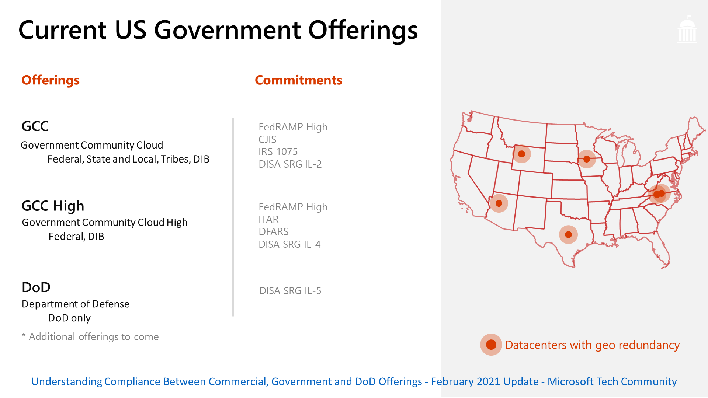
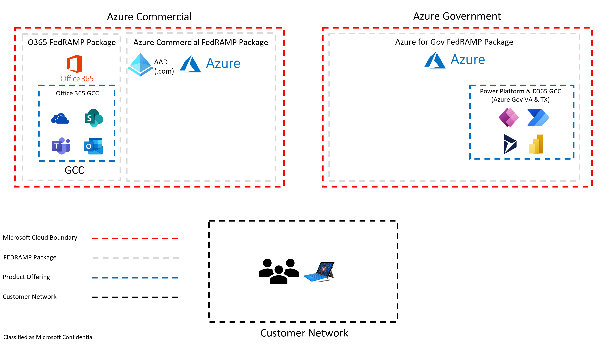
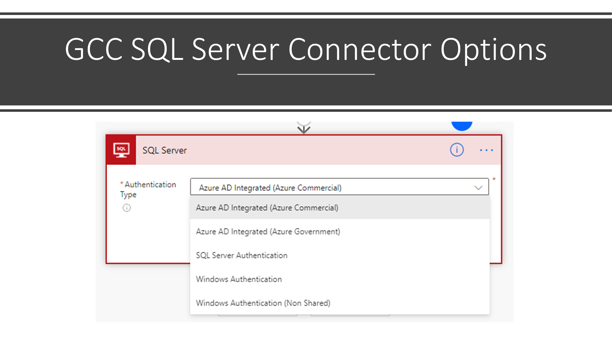
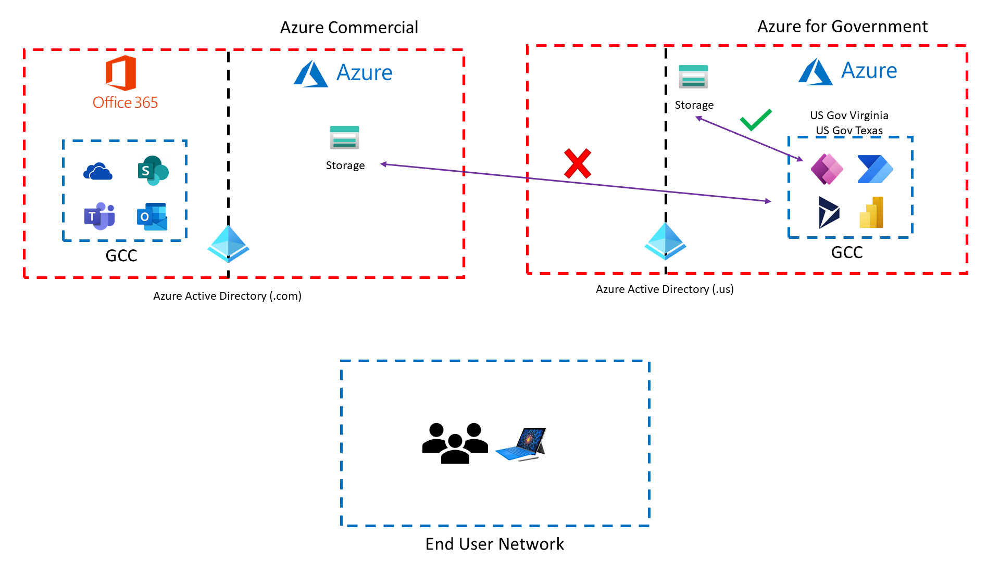
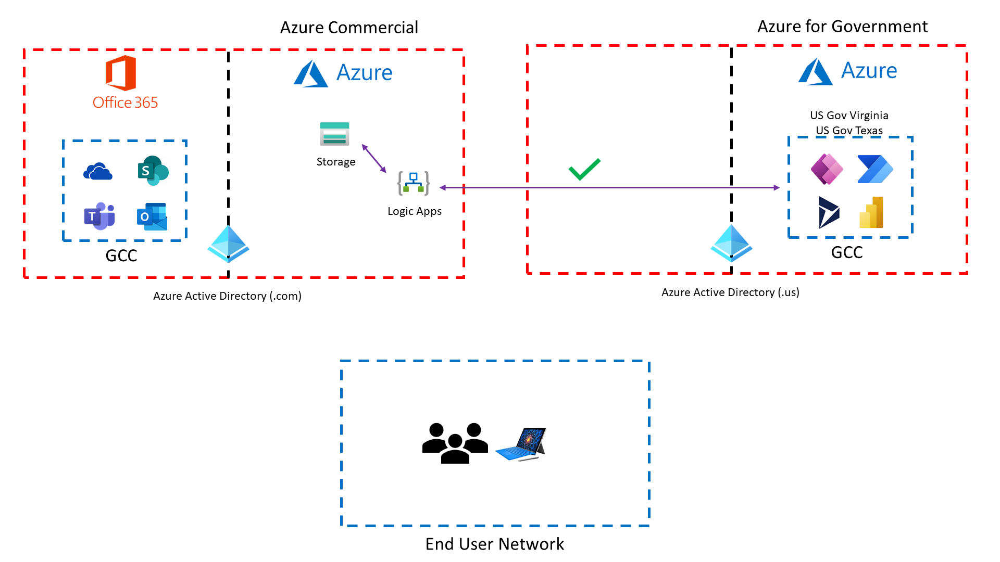
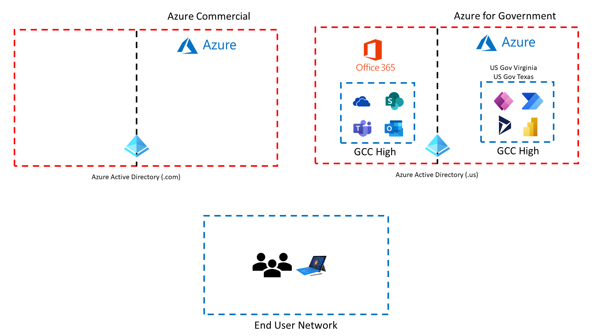
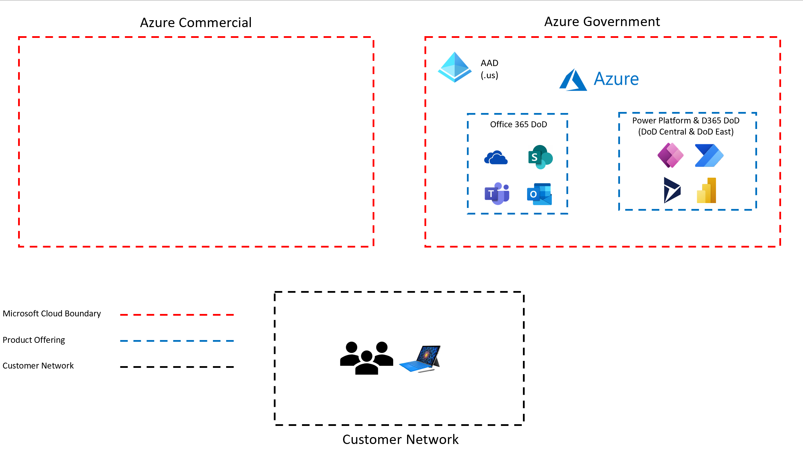

# US Government Power Platform / Dynamics 365 Architecture

## US Government Specific Documentation

* [Power Automate US Government Docs](https://docs.microsoft.com/en-us/power-automate/us-govt)
* [Power Apps US Government Docs](https://docs.microsoft.com/en-us/power-platform/admin/powerapps-us-government)
* [Dynamics 365 US Government Docs](https://docs.microsoft.com/en-us/power-platform/admin/microsoft-dynamics-365-government)

## US Government Feature Parity Documentation

[US Government Power Platform / Dynamics 365 Feature Matrix](https://aka.ms/BAPFunctionalParity)

## US Government Cloud Video Recordings
Below is a presentation recording covering US Gov Cloud specific architecture of Power Platform and Dynamics 365 at a Meetup group talk.  The video recording can be found below,

[Power Platform / Dynamics 365 US Government Cloud Overview](https://www.youtube.com/watch?v=027gVhqt1l0&t=101s)

There's also a great video that overviews all of Microsoft's Sovereign Clouds,

[Microsoft Sovereign Clouds - Power CAT Live](https://www.youtube.com/watch?v=DMg3uQ5EFLI)

## US Government Cloud Offerings

## GCC Architecture

### GCC Power Platform Connectors
The list of GCC Power Platform connectors available can be found below,

[GCC Power Platform Connectors List](https://gov.flow.microsoft.us/en-us/connectors/)

### Azure Commercial vs Azure for Government in GCC

Today, for GCC customers, you have the option with certain Azure connectors (e.g., SQL Server) to toggle between Azure for Government or Azure Commercial subscription.  This toggle option will eventually make its way to other Azure connectors in Power Platform GCC.

Today, some connectors in GCC Power Platform service will assume that the resources you want to use are only Azure for Government resources.

A work around for the listed scenario above is to create a Azure Logic App in Azure Commercial and use that with the Azure commercial connectors to get access to the resources you want to leverage,

## GCC High Architecture

### GCC High Power Platform Connectors
The list of GCC High Power Platform connectors available can be found below,

[GCC High Power Platform Connectors List](https://high.flow.microsoft.us/en-us/connectors/)

## DOD Architecture

### DOD Power Platform Connectors
The list of DOD Power Platform connectors available can be found below,

[DOD Power Platform Connectors List](https://flow.appsplatform.us/en-us/connectors/)
