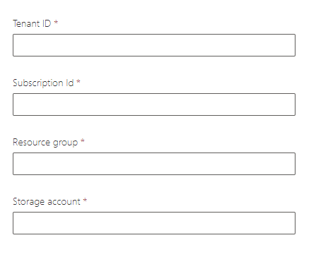

# Power Platform Azure Synapse Link Integration
> To date (9/3/2021), this feature is only supported in GCC.  This will eventually land in our GCC High and DoD clouds as well.

## GCC

You have two implementation options to integrate Power Platform Dataverse tables with Azure Synapse Link.  

Option 1 is to use an Azure Commercial subscription that is associated to the same tenant as your O365 subscription.  Option 2 is to use an Azure for Government subscription.

### Azure Commercial Subscription
Below is an architecture diagram of how everything is laid out with this setup,


If you have an associated Azure Commercial subscription with your tenant, then you can follow the commercial public docs to set this up,

[Azure Synapse Link Setup Documentation](https://docs.microsoft.com/en-us/powerapps/maker/data-platform/azure-synapse-link-synapse)

### Azure for Government Subscription

Below is an architecture diagram of how everything is laid out in this setup,


### Setup Notes for Azure for Government

> Important: you need to have at least Application Administrator privileges to create a new Service Principal. Global Administrator would work as well.  

Use the PowerShell script below in your Azure for Government subscription to provision the "Export to data lake" service principal account.

```powershell
# Authenticate to Azure for Government
Connect-AzAccount -Environment AzureUSGovernment 

# Provision the "Export to data lake" Service Principal account
New-AzADServicePrincipal -ApplicationId '7f15f9d9-cad0-44f1-bbba-d36650e07765' 
```

Next you need to create an Azure Storage account (Gen 2).


Make sure you mark "Enable hierarchical namespace" in the advanced section.


Once provisioned, you need to grant the "Export to data lake" service principal the following role assignments in IAM,

* Owner
* Storage Account Contributor
* Storage Blob Data Contributor
* Storage Blob Data Owner

Open up the Marker Portal in GCC (https://make.gov.powerapps.us) and select the environment you want to setup.

Add the following query string ```?athena.advancedSetup=true``` to the end of the URL.  For example,

```
https://make.gov.powerapps.us/environments/aaaaaa-xxx-4442-8f7e-229b080exxx/exporttodatalake?athena.advancedSetup=true
```

Click on the Azure Synapse Link menu item


Click on "New link to data lake"


Fill out the following fields,



Select next.  Choose the Dataverse tables you want to sync and finish the setup.

> If you get an error that a file system name does not exist, you may need to manually create the storage container via the Azure Portal.


Once that is working, you can optionally provision Azure Synapse Analytics using the already configured Azure Storage account.
